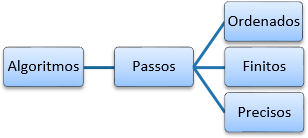
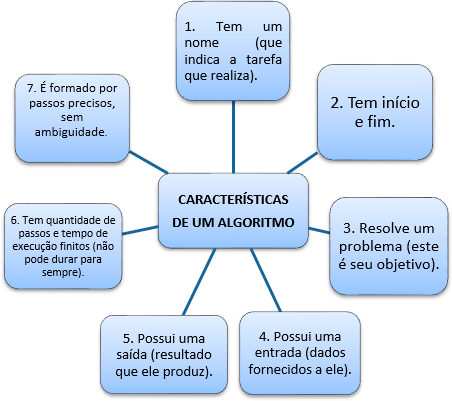
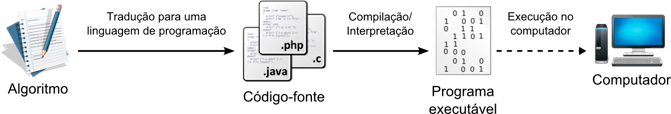
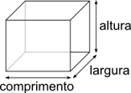
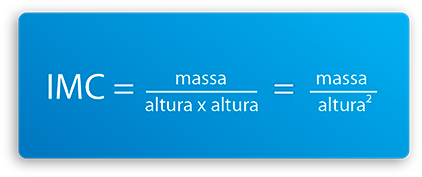
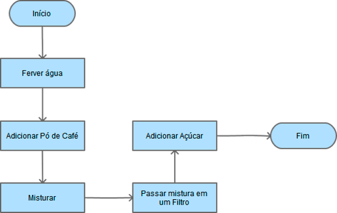
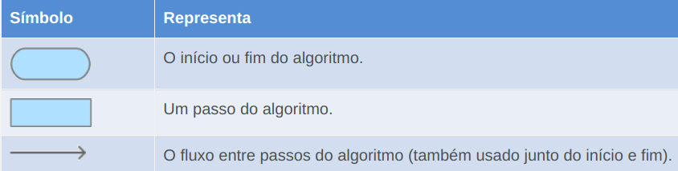

\tableofcontents

# 1. Introdução

Caro(a) aluno(a),

Esta é a nossa terceira aula do Curso de Introdução à Lógica de Programação e pode ser considerada uma das mais importantes. Nesta aula, teremos o primeiro contato com a ideia de algoritmo. Veremos que algoritmos fazem parte da nossa vida, mesmo que não percebamos.

Conheceremos as partes fundamentais de um algoritmo e como criá-lo. Além disso, analisaremos a função dos algoritmos de nos fazer pensar com astúcia sobre um problema, de forma a encontrar não apenas as soluções para ele, mas também de buscar a melhor solução. Esse tipo de estratégia é essencial para um profissional da área de computação. Também conheceremos um pouco sobre fluxogramas, que são uma outra forma de representar algoritmos.

Está pronto? Então vamos lá!

## Objetivos

+ Explicar o conceito de algoritmo;
+ Analisar um problema do mundo real e criar um algoritmo para resolvê-lo;
+ Utilizar o conceito de abstração na produção de algoritmos;
+ Compreender o que são fluxogramas e como criá-los a partir de algoritmos.

---

# 2. O que são algoritmos?

\vspace*{0.2cm}

> **Objetivo**

> + Explicar o que é um algoritmo e qual a sua função.

\vspace*{0.2cm}

Durante este tópico, iremos compreender o que são algoritmos e como eles são fundamentais para a construção de programas de computador. Veremos alguns exemplos para identificarmos as características que todo algoritmo apresenta.

Na aula anterior, você teve o primeiro contato com o conceito de abstração. Vimos alguns exemplos da análise de objetos e situações do dia a dia, com o objetivo de extrair suas principais características. Essas características nos permitem construir um modelo, uma representação de objeto ou situação, contendo aquilo que é relevante. A partir daí, podemos trazer esse modelo para dentro do computador, para que ele nos ajude em diversas tarefas.

O computador é capaz de receber um conjunto de dados e uma lista de comandos que ele consiga executar. O encadeamento dessa lista de comandos é que faz o computador realizar tarefas grandes e complexas que produzem um resultado. Chamamos essa lista de comandos de algoritmo.

\vspace*{0.2cm}

## Definição de Algoritmo

Existem diversas definições para algoritmo, quase sempre ditas informais. Isso porque, assim como a lógica, é difícil propor uma definição formal única para algoritmo. Cormen (2002, p. 3) define:

> ... algoritmo é qualquer procedimento computacional bem definido que toma algum valor ou conjunto de valores como entrada e produz algum conjunto de valores como saída. Portanto, um algoritmo é uma sequência de passos computacionais que transformam a entrada na saída.

A definição proposta por Cormen (2002) é focada em algoritmos para construção de programas de computador, com um pouco mais de rigor técnico. Mas usamos algoritmos várias vezes por dia. Vejamos uma definição mais simples e próxima da nossa realidade: **algoritmo é uma sequência de passos ordenados e finitos, que visam resolver um problema**.

\newpage

Quando dizemos passos ordenados, significa que existe uma ordem entre esses passos e que a mudança dessa ordem pode influenciar o resultado da execução do algoritmo. Já a característica de passos finitos quer dizer que o algoritmo não pode ter uma quantidade infinita de passos. Afinal, um algoritmo com infinitos passos nunca teria sua execução concluída e, portanto, nunca chegaria a um resultado.

{ width=40% }

\vspace*{0.2cm}

A figura 2 apresenta as características fundamentais de um algoritmo:

{ width=50% }

\vspace*{0.2cm}

Já vimos algumas definições de algoritmos e suas características, que tal vermos agora alguns exemplos de algoritmos?

\vspace*{0.2cm}

**Algoritmo Preparar Café**

> **Início**  

> 1. Ferver a água.
> 2. Colocar o pó de café na água.
> 3. Misturar bem para dissolver o pó na água.
> 4. Passar a mistura no filtro de café.
> 5. Adicionar açúcar (opcional).

> **Fim**

Vejamos um novo exemplo, mais próximo dos computadores.

\vspace*{0.2cm}

**Algoritmo Enviar E-mail**

> **Início**

> 1. Fazer login no seu provedor de e-mail.
> 2. Clicar no botão de criar e-mail.
> 3. Preencher o campo referente ao destinatário com o endereço de e-mail da pessoa para quem você quer enviar a mensagem.
> 4. Preencher o campo referente ao assunto ao qual se refere à sua mensagem.
> 5. Escrever a sua mensagem na área de mensagem.
> 6. Enviar a mensagem clicando no botão de envio.

> **Fim**

\vspace*{0.4cm}

Você pode estar pensando: um algoritmo para preparar café? Um algoritmo para enviar e-mail? Esses são exemplos de tarefas que são executadas com frequência. E o que existe de comum entre o exemplo do preparo de café e envio de e-mail? As características de um algoritmo. Veja o quadro 1, a seguir. Ele aponta as características dos algoritmos em cada um dos dois exemplos citados.

\newpage{}

| Característica    | Algoritmo Preparar  Preparar Café. | Algoritmo Enviar E-mail     |
| :---------------- | :--------------------------------: | --------------------------: |
| Tem um nome       | Preparar café                      | Enviar e-mail               |
|                   |                                    |                             |
|                   |                                    |                             |
| Resolve um        | Fazer uma                          | Enviar um e-mail para um    |
| problema.         | xícara/bule de café.               | amigo/colega de             |
|                   |                                    | trabalho/etc.               |
|                   |                                    |                             |
|                   |                                    |                             |
|                   |                                    | Endereço de e-mail do       |
|Possuí uma entrada | Café, açúcar e água.               | destinatário, assunto e     |
|                   |                                    | mensagem.                   |
|                   |                                    |                             |
|                   |                                    |                             |
| Possui uma saída. | Café pronto para                   | Mensagem de e-mail          |
|                   | beber.                             | enviada.                    |
|                   |                                    |                             |
|                   |                                    |                             |
| Tem quantidade de |                                    |                             |
| passos e tempo de | 5 passos.                          | 6 passos.                   |
| execução finitos. |                                    |                             |
|                   |                                    |                             |
|                   |                                    |                             |
| É formado por     |                                    | Ex: Preencher campo         |
| passos precisos,  | Ex: ferver água,                   | referente ao destinatário;  |
| sem ambiguidade.  | adicionar açúcar.                  | Enviar a mensagem           |
|                   |                                    | clicando no botão de envio. |

\vspace*{-0.5cm}

> *Quadro 1 – Características dos algoritmos Preparar Café e Enviar E-mail*

\vspace*{0.3cm}

Podemos dizer, após vermos esses dois exemplos, que um algoritmo é como uma receita, um guia, um plano escrito da resolução de um problema ou execução de uma tarefa. Um algoritmo serve como referência sobre quais passos devemos executar para alcançar um objetivo. Esse objetivo pode ser simples como fazer um sanduíche, ou complexo como projetar um equipamento eletrônico.

\vspace*{0.2cm}

## Função de um algoritmo

Você pode se questionar sobre a função de um algoritmo, afinal, a maioria de nós não precisa de um guia escrito para preparar café ou enviar um e-mail. Mas o computador é diferente. Lembra que dissemos que o computador não tem a inteligência humana? Pois é, ele precisa de instruções para executar cada tarefa que lhe damos, mesmo que ele já a tenha feito diversas vezes.

> Os algoritmos são a base para um programa de computador, seu alicerce, mas não são o programa em si. Se você quer aprender a programar, tem que aprender a desenvolver algoritmos primeiro. E, para isso, você não precisa de um computador. Tudo o que você precisa para desenvolver algoritmos é a capacidade de analisar tarefas e descrever cada passo necessário para realizá-las.

\vspace*{0.2cm}

No próximo tópico, veremos mais exemplos de algoritmos. Por hora, é importante que você compreenda bem as seguintes ideias:

> 1. Algoritmos não são exclusivos para computadores, são uma descrição da execução de qualquer tarefa.
> 2. Na computação, algoritmos são a base para a criação de programas de computador.

A partir de um algoritmo, podemos escrever um programa usando uma linguagem de programação. É uma espécie de tradução: primeiro criamos o algoritmo, depois o traduzimos para linguagem de programação, o que chamamos de código-fonte. Só depois o computador compila ou interpreta esse código-fonte, transformando-o em um programa executável.

\vspace*{0.3cm}

{ width=95% }

> Os processos de compilação e interpretação têm como objetivo transformar um código-fonte em algo que o computador possa executar. Esses dois processos diferem com relação ao momento dessa transformação: prévia, no caso da compilação, ou tardia (no momento de usar o programa), no caso da interpretação.

Entenda que conhecer a fundo uma linguagem de programação é fundamental para escrever o código-fonte, mas o seu algoritmo influenciará muito mais a qualidade do seu programa do que seu conhecimento sobre linguagens. É nesse momento que podemos perceber a importância da criação dos algoritmos. Um algoritmo bem feito economiza tempo em correções no seu programa. Vamos fazer um pequeno exercício para compreender e fixar bem essa ideia?

---

## Quiz

Imagine que você está construindo uma nova casa. Essa nova casa tem uma planta, ou seja, um projeto da sua estrutura desenhado por um engenheiro ou arquiteto. Digamos que esse projeto contém uma falha: uma das vigas está com o tamanho errado e isso pode comprometer a estrutura da casa. Agora responda, em qual fase é mais fácil e mais barato consertar essa falha?

a) Na planta (projeto da casa)
b) Na casa já pronta.

Resposta: a

---

É muito mais simples, rápido e até mais barato corrigir uma falha no projeto da casa, antes de construí-la. Uma pequena reforma na casa já pronta pode significar ter que quebrar outras partes que não têm relação direta com o que precisa ser mudado e isso significa mais trabalho, o que custa mais tempo e dinheiro.

Da mesma forma, é muito melhor identificar e corrigir erros nos algoritmos do que nos códigos-fonte. Códigos-fonte geralmente são feitos por equipes, por várias pessoas. A correção de um código-fonte com o qual você não tem familiaridade é bastante complicado. Imagine ter que encontrar um objeto numa casa que você não conhece, é uma tarefa difícil.

Chegamos ao final desse tópico. Conhecemos o conceito de algoritmo e suas características. Também discutimos a importância do uso de algoritmos na computação e vimos que eles são a base de qualquer programa de computador. No tópico seguinte, nos concentraremos na criação de algoritmos.

---

# 3. Construção de Algoritmos

> **Objetivos**

> 1. Reconhecer os elementos fundamentais de um algoritmo;
> 2. Organizar os passos para a construção de um algoritmo.

No tópico anterior, estudamos as características de um algoritmo e o que faz dele fundamental para a computação. Vimos que todo algoritmo tem uma entrada e uma saída, é composto por passos ordenados e que sua função é descrever uma solução para um problema. Neste tópico, analisaremos alguns algoritmos para identificarmos o que é importante para criar novos algoritmos. Também discutiremos qualidade de algoritmos e como aplicar testes a eles.

Agora vamos analisar alguns algoritmos para identificar seus elementos fundamentais.

\newpage

*Algoritmo* **Fazer Fotografia em Câmera Digital**

> **Início**

> 1. Ligar câmera.
> 2. Escolher objeto ou paisagem para fotografar.
> 3. Segurar firme a câmera e pressionar levemente o botão de disparo para ajustar o foco.
> 4. Manter a câmera firme e pressionar o botão do disparo até o fim para fazer a fotografia.

> **Fim**

\vspace*{0.1cm}

O objetivo desse algoritmo é produzir uma fotografia de um objeto ou paisagem em uma câmera digital. Compreender bem o objetivo do algoritmo é fundamental para não cometermos enganos ao identificar seus dois elementos-chave: a entrada e a saída. Nesse caso, a entrada é o objeto ou paisagem que queremos registrar em uma foto. A saída, ou resultado, é uma foto do objeto ou paisagem escolhido.

\vspace*{0.3cm}

{ width=60% }

\vspace*{0.3cm}

Vejamos mais um exemplo.

\newpage

*Algoritmo* **Desenhar um Quadrado**

> **Início**

> 1. Sabendo o tamanho que o lado do quadrado deve ter, desenhar uma linha reta da direita para a esquerda do tamanho do lado.
> 2. A partir do final da primeira linha (girando 90$^\circ$), desenhar uma segunda linha de cima para baixo, do tamanho do lado. 
> 3. A partir do final da segunda linha (girando 90$^\circ$), desenhar uma terceira linha da direita para a esquerda, do tamanho do lado.
> 4. A partir do final da terceira linha (girando 90$^\circ$), desenhar uma quarta linha de baixo para cima, do tamanho do lado.

> **Fim**

\vspace*{0.4cm}

Nesse algoritmo, precisamos do tamanho do lado do quadrado como entrada para produzir o desenho do quadrado como saída. Nesse caso, podemos notar com mais clareza onde se encaixa o conceito de abstração estudado na aula passada. O que chamamos de tamanho do lado do quadrado é uma abstração de uma medida real, expressa na forma de um número e uma unidade de medida, como 5 centímetros ou 2,7 metros.

\vspace*{0.4cm}

**Construção de Algoritmos**

Até agora só analisamos algoritmos prontos. Mas como já sabemos que um algoritmo é uma sequência de passos ordenados para realizar uma tarefa, que possui entrada (aquilo que ele usa para realizar a tarefa) e saída (aquilo que ele produz após executar todos os passos), estamos aptos a criar nosso próprios algoritmos.

A criação de um algoritmo é um **processo criativo**. Isso significa que você precisa, basicamente:

> 1. **Analisar a tarefa que deseja realizar**  
> 2. **Identificar o que você precisa para realizá-la**  
> 3. **Criar uma sequência de passos que executa essa tarefa com sucesso e produz o resultado esperado**  

\vspace*{0.3cm}

Estas são apenas dicas. Você irá fazer tudo da sua maneira, baseado na sua experiência. Não existe uma regra fechada ou procedimento padrão para produzir algoritmos. Ou seja, não existe um algoritmo para criar algoritmos.

Vamos praticar a criação de algoritmos?

## Exercício 4

Algoritmo **Calcular o custo para enviar uma caixa pelo Correio**

Você vai enviar uma caixa com presentes para um amigo. Considerando que sua caixa estará dentro da faixa de peso base do correio, o preço do envio será baseado apenas no volume da caixa. Para calcular o valor do envio antes de ir à agência, o correio lhe fornece um valor padrão de custo por cm³ (centímetro cúbico).

Por exemplo, se o valor de referência é R$ 0,15/cm³ (quinze centavos por centímetro cúbico), basta calcular o volume da caixa que deseja enviar e multiplicar pelo valor de referência.

Produza o algoritmo para resolver esse problema.

\vspace*{0.2cm}

> **Dica 1**:
> Considere que você ainda não sabe as medidas da caixa, então inclua passos no algoritmo para medi-la.

> **Dica 2**:
> O volume de uma caixa é igual ao produto do comprimento x largura x altura.

\vspace*{0.2cm}

> > > > > > { width=20% }

\vspace*{0.2cm}

***Entrada***: A caixa e o valor de referência do Correio.

***Saída***: O preço, em reais (R$), para o envio da caixa.

\vspace*{0.2cm}

Ordene os passos a seguir para montar o Algoritmo correto.

*obs: nem todos os passos fazem parte do algoritmo*

\vspace*{0.2cm}

+ Lacrar/embalar a caixa
+ Multiplicar o volume pelo valor de referência
+ Multiplicar “área” pela altura e anotar como “volume”
+ Multiplicar o volume pelo peso
+ Preencher os dados de envio na caixa
+ Anotar o valor do envio em R$
+ Medir a altura da caixa (1)
+ Multiplicar comprimento por largura e anotar como valor da “área”
+ Medir o comprimento da caixa
+ Multiplicar altura por peso
+ Medir a largura da caixa
+ Pesar a caixa e anotar como “peso”

\vspace*{0.4cm}

Resposta:

**Início**

+ Medir a largura da caixa
+ Medir a altura da caixa (1)
+ Medir o comprimento da caixa
+ Multiplicar comprimento por largura e anotar como valor da “área”
+ Multiplicar “área” pela altura e anotar como “volume”
+ Multiplicar o volume pelo valor de referência
+ Anotar o valor do envio em R$

**Fim**

\vspace*{0.2cm}

A resolução desse problema ressalta novamente o que aprendemos sobre abstrações.

Embora algumas informações sobre a caixa, como peso e dados de envio, sejam relevantes para o envio, não são relevantes para o problema que estamos tratando, que só precisa do volume da caixa e valor de referência do correio.

## Conceito de Memória

Você deve ter percebido que, para o algoritmo anterior (exercício 4), alguns passos não precisam necessariamente vir antes que outros. Por exemplo, medir a altura da caixa não precisa vir antes de medir a largura, ou o comprimento. Mas para calcular o valor do envio, você precisa calcular o volume da caixa primeiro e **anotar** esse valor em algum lugar.

A ação de anotar valores calculados durante algoritmos é essencial para o seu funcionamento. Você pode dizer: “Ah, não preciso anotar, eu lembrarei do valor”. Você pode lembrar do valor, porque seres humanos têm uma boa **memória**. O computador também tem memória, mas é você que tem a responsabilidade de fazê-lo guardar determinados valores nela. \underline{A ação de guardar dados na memória também precisa estar no algoritmo.}

> Normalmente, quanto maior for a complexidade de um algoritmo, maior será a necessidade de armazenar dados em memória. Esses dados servem de referência para cálculos e tomadas de decisão futuros no algoritmo.

## Qualidade de algoritmos

Dissemos que um algoritmo é uma receita, um guia para resolução de um problema. E você deve saber que geralmente existe mais de uma maneira de resolver um problema. Quer um exemplo? Vamos lá!

Digamos que Lara quer sair de sua casa e ir até o shopping. Ela tem três opções: ir de carro, ir de ônibus ou ir à pé. Faça Lara ir ao shopping de cada uma das maneiras e observe os resultados.

Como você viu, todas as opções levam Lara até seu destino, ou seja, o objetivo será alcançado. Porém, cada uma tem seus pontos positivos e negativos.

+ Ir de carro é rápido, mas custa mais caro (gasolina e estacionamento).
+ Ir de ônibus é mais barato que ir de carro, mas demora mais (o ônibus para várias vezes no trajeto).
+ Ir à pé é de graça, mas pode cansar e demora mais que todos os outros.

Nenhuma das opções parece perfeita. Mas Lara pode escolher a mais conveniente. Ou pensar em uma nova maneira que combine as boas características de cada opção. Ir de bicicleta, por exemplo.

A mesma relação vale para os algoritmos. Você pode construir diversos algoritmos para resolver um mesmo problema de maneiras diferentes. Um pode ser mais rápido, outro mais simples de ler e entender, outro que contenha pouquíssimos passos etc. Algoritmos novos podem ser criados e algoritmos antigos, melhorados.

## Cuidados especiais com algoritmos

A criação de um algoritmo geralmente não leva muito tempo. Mas, uma vez que estiver pronto, precisa ser testado à exaustão para garantir que seus passos serão executados corretamente e o resultado final, ou seja, a saída do algoritmo, será o que se espera. Raramente um algoritmo permanece exatamente igual à sua primeira versão.

Para demonstrar o que foi dito, vamos criar um algoritmo simples, porém útil, que calcula o IMC (Índice de Massa Corporal). O IMC é um índice que indica se a pessoa está dentro da faixa de peso ideal para sua altura. O IMC de uma pessoa com peso ideal está entre 18,5 e 25. Sua fórmula é igual à massa (que geralmente chamamos de peso) dividido pelo quadrado da altura.

> > { width=75% }

\newpage{}

Um algoritmo para calcular o IMC e dizer se a pessoa está ou não no peso ideal seria:

---

**Entrada**: Massa (peso) e altura do indivíduo.  
**Saída**: “Sim”, se o IMC estiver entre 18 e 25. “Não”, caso contrário.

---

**Início**

1. Calcular o valor do quadrado da altura e anotar como “altura ao quadrado”.
2. Calcular o valor da massa dividido pelo quadrado da altura e anotar como “IMC”.
3. Se o valor de “IMC” for maior ou igual a 18,5 e menor que 25, dizer “Sim”. Caso contrário, dizer “Não”.

**Fim**

---

Você pode testar o algoritmo com sua altura e peso. Por exemplo:  para uma altura de 1,75m, o valor de “altura ao quadrado” será 3,0625. Se a massa for 76kg, o valor para “IMC” será 76 / 3,0625 = 24,81. A saída do algoritmo seria “Sim”. Já para uma altura de 1,73m e 85kg de massa, a saída do algoritmo seria “Não”, pois o IMC seria igual a 85 / (1,73)$^2$ = 28,40.

Esse algoritmo parece perfeito. Mas possui falhas. O que acontece, por exemplo, se fornecemos 0 (zero) como valor da altura? Nesse caso, o algoritmo tentará efetuar uma **divisão por zero**, o que não é possível.

Nossa obrigação, então, é de proteger o algoritmo de valores inválidos de entrada, como 0 (zero) para a altura. Para isso, vamos adicionar um novo passo, no lugar do passo 1, com a seguinte estrutura: Se o valor da massa ou altura for igual a zero, dizer “Valores inválidos” e terminar. Como um valor 0 (zero) para massa também não faz sentido, ele também é avaliado nesse novo passo.

O que fizemos foi criar uma \underline{condição} para que o algoritmo continuasse ou fosse interrompido. Essa é uma prática comum e teremos uma aula exclusiva sobre esse tema. Em geral, usamos condições para executar determinados passos de um algoritmo e ignorar outros. No exemplo do IMC, caso massa ou altura sejam iguais a zero, ignoramos todos os demais passos do algoritmo.

## Testes de algoritmo

Vimos que um algoritmo, mesmo que tenha sido criado com muito cuidado e atenção, pode conter falhas. Você sabe como proceder para detectar essas falhas? Basta seguir o exemplo da indústria: **testar**.

Os testes são a forma mais simples de validar se um algoritmo realmente faz o que promete, ou seja, se ele é capaz de produzir o resultado esperado para todas as situações (valores de entrada) às quais pode ser submetido.

> *Existem outras maneiras de validar um algoritmo além dos testes, como a prova por modelos matemáticos. Esse método, porém, é muito refinado e demanda profissionais altamente qualificados. É aplicado em algoritmos voltados para programas considerados críticos, como os que funcionam em usinas nucleares, em sistemas de navegação de aviões e trens e em equipamentos hospitalares.*

Para testar um algoritmo, crie um conjunto de dados de entrada que represente a realidade à qual o algoritmo será submetido e o resultado que se espera obter como saída do algoritmo. Execute o algoritmo para a entrada e verifique se a saída esperada foi obtida. Se a saída obtida não for aquela que se espera, seu algoritmo tem falhas e precisa ser revisado.

Vejamos um exemplo. Se quisermos testar o algoritmo para ordenação de três números do início do tópico, podemos montar um grupo com 4 tipos de conjuntos:

+ Um conjunto com números em ordem aleatória (Ex: {3,-5,2});
+ Um conjunto com números em ordem decrescente (Ex: {8,2,0});
+ Um conjunto com números já em ordem crescente (Ex: {-1,2,3});
+ Um conjunto com números repetidos (Ex: {3,2,3}).

Essas quatro \underline{classes} de entrada cobrem todas as possibilidades que esse algoritmo em particular pode encontrar quando for usado. Cada classe representa um tipo de entrada. Um algoritmo para outro problema de ordenação, para uma quantidade indefinida de elementos, por exemplo, pode precisar de outras classes de entrada para ser testado por completo.

Chamamos cada um dos exemplos de cada classe citados ({3,-5,2}, {8,20}, {-1,2,3} e {3,2,3}) de caso de teste. Quantos mais casos de teste você aplicar ao seu algoritmo, melhor. Porém, é preciso usar casos de teste de classes diferentes. Não adianta testar seu algoritmo com 5000 casos de teste de elementos em ordem decrescente e não testá-lo para elementos em ordem crescente, aleatória ou para elementos repetidos.

Vamos exercitar um pouco a escolha de casos de teste? Indique o item que possui o conjunto mais completo de casos de teste para cada algoritmo a seguir, ou seja, o conjunto de casos de teste que avalia o algoritmo para mais casos diferentes e relevantes.

Agora é a sua vez! Escolha o item que possui o melhor conjunto de dados para teste dos algoritmos a seguir.

\newpage{}

> **Exercício 5** - Algoritmo Somar dois números inteiros

> Entrada: um par de números inteiros  
> Saída: o valor da soma do par de números fornecidos

> a) {-2, -3}, {0, -25}, {-3, -10}, {-9, 0}, {-3, -1}
> b) {6, 5}, {10, 99}, {13, 0}, {4, 9}, {5, 5}
> c) {1, 7}, {0, -1}, {-3, -10}, {5, 0}, {3, -2}
> d) {1, 7}, {-5, -1}, {-20, -2}, {5, 0}, {-9, -10}

> *Resposta: c)*

> **Exercício 6** - Algoritmo Buscar menor valor no conjunto
 
> Entrada: um conjunto não vazio de números inteiros.  
> Saída: o valor do menor número do conjunto.
 
> a) {3}, {4}, {5}
> b) {1}, {2, 3, 2}, {0, 1, -5, 3}
> c) {1, 2, 3, 4}, {3, 3, 2, 3}
> d) {2, 3}, {1, 2, 3, 4}, {6}

> *Resposta: b)*

> Iremos aprender mais sobre testes durante as próximas aulas.

## A importância dos algoritmos

Muitos estudantes insistem em deixar o estudo de algoritmos de lado, tentando criar os seus programas diretamente com linguagem de programação, sem escrever um algoritmo primeiro. Essa atitude resulta em programas com falhas, desempenho ruim ou que sequer funcionam. Embora pareça retrabalho escrever o algoritmo para depois reescrevê-lo em linguagem de programação, esse processo ajuda a identificar falhas mais cedo e perceber detalhes menos aparentes de um problema.

Por isso, não deixe de escrever o algoritmo de um programa que você pretende fazer. Depois que ele estiver pronto, execute-o mentalmente, anotando valores que foram produzidos durante os passos e verifique se a saída (resultado) foi o que se esperava, como fizemos nessa aula. Teste-o com diversos valores de entrada. Isso permite que você faça ajustes ainda no algoritmo, que são mais fáceis de aplicar que no código-fonte.

> Esse é um curso de lógica de programação, então você deve esperar por conteúdos que lhe preparem para criar programas. Na computação, os algoritmos são geralmente voltados para operações matemáticas. Portanto, você verá muitos exemplos de ordenação de números (ou elementos quaisquer), cálculo de fórmulas, problemas de busca de dados etc.

Nesse tópico, aprendemos que um algoritmo tem sempre uma entrada e uma saída, que correspondem aos dados que precisamos prover ao algoritmo e ao resultado que ele produz, respectivamente. Vimos que, para criar um algoritmo, precisamos analisar seu problema alvo com cuidado. Às vezes, alguns detalhes passam despercebidos e podem comprometer a qualidade do algoritmo. Executar testes é a melhor forma de verificar se um algoritmo cumpre sua tarefa sem falhas.

No próximo tópico, iremos conhecer uma maneira diferente de representar um algoritmo: os fluxogramas.

# 4. Introdução a Fluxogramas

> **Objetivo**

> + Compreender a função de um fluxograma e sua estrutura básica.

Durante toda essa aula, estudamos o que são algoritmos, como eles podem ser construídos e como testá-los. Como você deve ter percebido, um algoritmo é uma sequência de passos escritos, em linguagem natural, que pode ser posteriormente traduzido para linguagem de programação, tornando-se um código-fonte.

Mas existe uma outra forma de representar um algoritmo, utilizando fluxogramas. Fluxogramas são diagramas indicados para representar eventos dinâmicos, ou seja, que obedecem a um fluxo. Por isso, um algoritmo pode ser representado na forma de um fluxograma, com o objetivo de facilitar o seu entendimento.

Veja o exemplo de fluxograma a seguir. Ele corresponde ao fluxograma do algoritmo de preparo de café, que vimos no começo da aula.

{ width=70% }

O fluxograma da figura 5 é bastante simples, pois representa um algoritmo muito simples. Percebemos que existe um fluxo que vai de “Início” até “Fim”, indicado pelas setas. Se pusermos o algoritmo original e seu fluxograma lado a lado, logo percebemos que os símbolos seguem o seguinte padrão:

> *Quadro 2: Componentes de um fluxograma simples*

Um fluxograma pode conter muito mais símbolos e nós conheceremos alguns deles durante o restante do curso. À medida em que formos incorporando novos elementos aos nossos algoritmos, iremos conhecer suas representações em fluxograma.

## Função do fluxograma

Você pode ter achado que um fluxograma como o da figura 5 não tem utilidade. De fato, fluxogramas de algoritmos extremamente simples não trazem grandes benefícios. Mas por se tratar de uma representação gráfica, fluxogramas de algoritmos complexos se tornam uma poderosa ferramenta para a sua compreensão.

Outra função dos fluxogramas é facilitar o processo de teste de um algoritmo. Visualmente é mais fácil de saber em qual passo do fluxograma você está do que lendo um algoritmo escrito.

## Como criar fluxogramas

Os fluxogramas são uma espécie de transcrição do algoritmo escrito para uma representação gráfica, assim como o código-fonte é o algoritmo reescrito em linguagem de programação. Começamos pelo bloco “Início” e depois adicionamos cada um dos passos do algoritmo em um retângulo, ligando-os com as setas. Por fim, ligamos o último passo com uma seta ao bloco “Fim”.

Você pode fazer um fluxograma no papel ou usar um dos diversos softwares disponíveis no mercado para desenho de diagramas. Os pacotes Office e LibreOffice possuem funcionalidades embutidas para criação de fluxogramas nos seus editores de texto.

Nesse tópico, tivemos uma noção geral sobre fluxogramas e sua relação com algoritmos. O estudo dos fluxogramas evoluirá gradualmente a cada nova aula desse curso.

> *Chegamos ao final da aula. Conhecemos o conceito de algoritmo e compreendemos porque ele é tão importante para a computação. Vimos que algoritmos são passos ordenados para resolver problemas e que, a partir deles, podemos criar um código-fonte em uma linguagem de programação. Vimos que um algoritmo representa o processamento entre uma entrada e a saída e conhecemos os fluxogramas, que são uma maneira de representar um algoritmo graficamente.*

> *Na próxima aula, nos aproximaremos um pouco mais das linguagens de programação, estudando os tipos de dados que podemos usar para representar informações nos algoritmos. A partir daí poderemos trabalhar com valores constantes, valores variáveis e expressões. Até breve!*