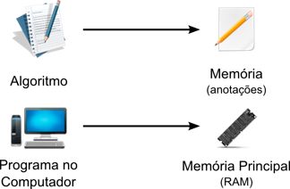
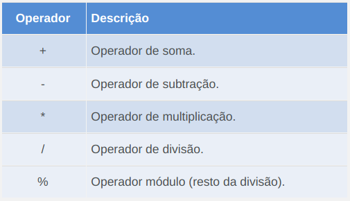
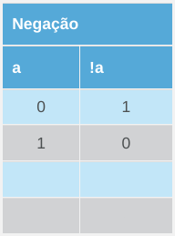
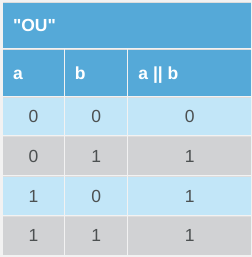
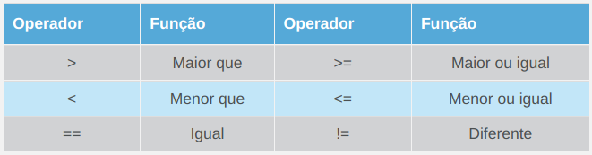
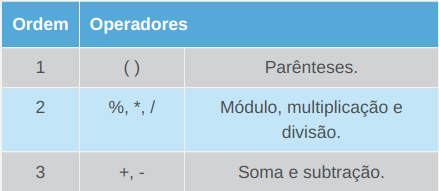

\tableofcontents
 

# Introdução

Caro(a) aluno(a),

Chegamos à nossa quarta aula do Curso de Introdução à Lógica de Programação. Já estudamos os conceitos básicos de abstração e, na aula passada, conhecemos os algoritmos.

Nesta aula, iremos sedimentar o conceito de memória introduzido na aula anterior e conheceremos os tipos de dados mais comuns usados para guardar dados durante o uso de um algoritmo. Também veremos como criar e resolver expressões lógicas e aritméticas em algoritmos e como utilizar as instruções de entrada e saída para fornecer e extrair dados do algoritmo. Vamos começar!

Está pronto? Então vamos lá!

> **Objetivos**

> + Identificar os tipos de dados de um valor em memória;
> + Compreender o conceito de constantes e variáveis;
> + Construir e resolver expressões lógicas e aritméticas;
> + Aprender a fornecer dados ao algoritmo e exibir mensagens.

# 1. Tipos de Dados Básicos

> **Objetivos**

> + Conhecer os tipos de representação de dados mais comuns;
> + Compreender a diferença entre constantes e variáveis;
> + Aprender a representar variáveis em algoritmos.

Neste tópico, veremos os tipos de dados mais comuns usados em algoritmos. Também discutiremos a diferença entre constantes e variáveis.

Na aula passada, conhecemos os algoritmos. Estudamos suas características e compreendemos que eles podem ser usados para descrever uma solução para um problema qualquer. Em resumo, um algoritmo consiste num conjunto de passos ordenados com o objetivo de realizar uma tarefa.

Ainda na aula passada, conhecemos o conceito de memória. Você ainda lembra o que é memória em um algoritmo?

## Revisão Sobre Memória

Quando efetuamos cálculos “de cabeça”, guardamos valores na memória, ou seja, no nosso cérebro. Mas fazemos isso **implicitamente**, sem a necessidade de pensar “Agora eu vou guardar esse valor para lembrar depois”; simplesmente lembramos.

Durante a execução de um algoritmo, é normal que precisemos anotar valores de cálculos e decisões tomadas, para utilizar esses valores futuramente dentro do algoritmo. Nesse caso, porém, é preciso formalizar a ação de registrar um valor.

Durante a aula passada, indicamos, no algoritmo, a necessidade de armazenar um valor com uma instrução chamada “anotar como” seguida de um nome para identificar o valor, por exemplo:

> Calcular a soma de dois números e **anotar** o resultado **como** “*Total*”.

{ width=50% }

\newpage{}

A identificação do valor é muito importante. Imagine que estamos resolvendo uma equação complexa e precisamos tomar nota de vários valores durante o processo. Se anotarmos os valores em um papel, sem identificá-los, podemos chegar à situação ilustrada na figura 1, em que não saberemos mais de qual operação cada valor foi obtido.

Além da identificação de cada valor, é importante sabermos o **tipo** de cada um deles. Por exemplo, se estivermos somando duas quantias em dinheiro, é relevante mantermos as casas decimais, relativas aos centavos. Porém, se estivermos calculando quantos pacotes de biscoito podemos comprar com uma determinada quantia de dinheiro, podemos descartar as casas decimais. Afinal, não podemos comprar 3,7 pacotes, só poderíamos comprar 3 ou 4 pacotes, nesse caso.

Chamamos de **memória** o local onde guardamos os dados de entrada e que foram gerados durante o uso de um algoritmo. A memória pode ser uma folha de papel, por exemplo, se estivermos executando um algoritmo manualmente, como no cálculo das raízes de uma equação do segundo grau da figura 2, a seguir:

{ width=70% }

Já no computador, existem diversos componentes que fazem a função de memória: discos rígidos, *pen drives*, DVDs etc. Porém, o componente que é considerado como memória principal é a memória RAM (*Random-Access Memory*, ou memória de acesso aleatório). Esse componente é bastante rápido e trabalha diretamente ligado ao processador para prover os valores que os programas precisam no menor tempo possível.

\newpage{}

{ width=70% }

Cada dado na memória deve ter um identificador (um nome) e um tipo. A memória funciona como uma grande tabela de consulta, na qual colocamos valores para uma consulta posterior. Valores armazenados na memória também podem ser modificados durante o tempo.

## Tipos de dados básicos

Sabendo que podemos armazenar diversos tipos de dados durante o uso de um algoritmo, tornou-se evidente a necessidade de padronizar os tipos de dados que poderiam ser usados na memória. Daí surgiram os tipos básicos de dados, também chamados de **tipos primitivos**.

Os tipos básicos ou primitivos são:

\newpage{}

{width=90%}

O tipo de dado é importante para a completa identificação de valores em memória nos casos em que existem duas anotações de mesmo nome. Assim, valores em memória com mesmo nome podem ser diferenciadas pelo seu tipo. Porém, o uso de nomes repetidos para representar dados na memória é desaconselhado.

## Variáveis x Constantes

Valores guardados na memória são chamados de **variáveis**. Variáveis, como o próprio nome diz, podem variar, ou seja, ter seu valor modificado. A função das variáveis é manter o valor atual de algum dado relevante dentro do algoritmo e, por isso, podem ser modificadas com o tempo.

Considere uma variável do tipo inteiro chamada “contador”, que no início do algoritmo tem valor igual a 0. Digamos que, após a execução de algum passo do algoritmo, o valor dessa variável precise ser 1. Devemos modificar o valor que está anotado, mudando-o de 0 para 1.

Porém, nem todos os valores que são necessários durante um algoritmo precisam mudar com o tempo. Alguns valores servem apenas como referência, durante todo o algoritmo, e permanecem inalterados.

Que tal alguns exemplos?

+ Para um algoritmo que efetua cálculos físicos, é preciso usar o valor da aceleração da gravidade (). Esse valor não muda.
+ Para um algoritmo que efetua cálculos trigonométricos, é preciso usar o valor de pi (). Esse valor não muda.
+ Para um algoritmo que faça o sorteio de dias de trabalho de um funcionário, é preciso ter acesso aos nomes dos dias da semana. Esses valores (nomes dos dias da semana) não mudam.

Para esses casos, chamamos os valores guardados de **constantes**, pois eles não precisam ser modificados durante toda execução do algoritmo. Em resumo:

> **Constantes**: São os valores que não se alteram

> **Variáveis**: São dados que podem mudar de valor

## Uso de variáveis em algoritmos

Agora que já sabemos o que são variáveis e constantes, como devemos usá-las nos nossos algoritmos? Na verdade, já estamos usando-as desde o início desse curso. Quando tínhamos uma instrução do tipo “anotar como”, estávamos criando ou modificando o valor de uma variável.

A partir de agora, iremos dedicar um espaço no início do algoritmo para indicar as variáveis que usaremos. Esse espaço é chamado de **região de declaração de variáveis**. A sintaxe é a seguinte: a região é identificada pela palavra “Variáveis”, seguida da lista de variáveis. Cada variável é declarada pelo seu nome, seguido de dois-pontos (:) e seu tipo. Veja um exemplo.

\vspace*{0.2cm}

```
Algoritmo Cadastrar Paciente
Variáveis:
      nome: Texto
      idade: Inteiro
      peso: Decimal
Início
. . .
Fim
```

\vspace*{0.2cm}

No exemplo do algoritmo Cadastrar Paciente, declaramos três variáveis chamadas **nome**, **idade** e **peso**. Não há diferença entre a declaração de variáveis e as constantes. Se uma variável nunca é modificada após receber seu primeiro valor, ela é considerada uma constante.

A identificação dos tipos das variáveis faz parte do processo de abstração, pois o tipo de dado informa quais operações a variável pode sofrer (operações aritméticas podem ser aplicadas a tipos numéricos, mas não a tipos Caractere ou Texto). Por exemplo:

> **Tipo Texto**: Variável para armazenar o nome de uma pessoa

> **Tipo Decimal**: Variável para armazenar a altura de um prédio

> **Tipo Lógico(Verdadeiro/Falso)**: Variável para armazenar se o aluno foi aprovado em uma disciplina

> **Tipo ????**: Variável para armazenar um número de telefone

Observe o último item do exemplo acima. Qual tipo devemos usar para armazenar um número de telefone em uma variável? Inteiro ou Texto? Isso depende da sua necessidade. Talvez, se você precisar guardar o número de telefone com traços e código DDD entre parênteses, é melhor usar o tipo Texto. Mas você também pode guardar o número como inteiro e dividi-lo em partes depois. É uma escolha de quem produz o algoritmo.

## Notação reduzida para declaração de variáveis

Vimos que a declaração de uma variável consiste em indicá-la no topo do algoritmo com seu nome e tipo de dado. Porém, em um algoritmo complexo, pode ser necessário que haja uma quantidade grande de variáveis. Se formos declarar uma a uma em cada linha com seu nome e tipo, o algoritmo terá muitas linhas apenas para declaração de variáveis.

Uma forma de diminuir o tamanho do algoritmo é agrupar as variáveis por tipo, separando-as por vírgula, como no exemplo a seguir.

\vspace*{0.2cm}

```
Algoritmo Agrupamento de Variáveis
Variáveis:
      a,b,c,d: Inteiro
      parcela_1, parcela_2: Decimal
      resultado: Texto
Início
      . . .
Fim
```

\vspace*{0.2cm}

No algoritmo do exemplo anterior, em vez de usarmos 7 linhas para declarar as variáveis a, b, c, d, parcela_1, parcela_2 e resultado, usamos apenas 3 linhas, já que as variáveis de mesmo tipo estão agrupadas.

Chegamos ao final desse tópico. Revisamos e aprofundamos o conceito de memória, conhecendo o que são variáveis e constantes. Vimos que variáveis e constantes precisam ter um nome e um tipo. Também aprendemos a usar variáveis e constantes dentro de algoritmos.

No tópico seguinte, conheceremos as propriedades dos principais operadores lógicos e aritméticos que podemos usar em nossos algoritmos. Nós já conhecemos a maioria deles de aulas passadas ou da matemática básica, mas alguns serão novos para você.

# 2. Operadores lógicos e aritméticos

> **Objetivos**

> + Conhecer o operador de atribuição e os operadores aritméticos;
> + Conhecer os operadores lógicos e relacionais e sua importância na construção de algoritmos;

No tópico anterior, aprendemos a declarar variáveis em algoritmos. Vimos que cada variável possui um nome (identificador) e um tipo. Agora vamos ver como representar a atribuição de valor a variáveis e aprender a função dos principais operadores lógicos e aritméticos.

## Primeiro passo: atribuição de valores

Agora que já sabemos declarar uma variável, vamos trocar algumas das instruções escritas que usamos em algoritmos por operadores. A primeira delas é a instrução de **atribuição**.

O operador de atribuição clássico é uma seta que aponta da direita para a esquerda: ←. Este símbolo é usado para indicar que um valor ou o resultado de uma expressão \underline{à direita} será atribuído a uma variável que está \underline{à esquerda}. Veja um exemplo:

\vspace*{0.2cm}

```
Algoritmo Exemplo 1
Variáveis:
    x: Inteiro
Início
    x ← 0
Fim
```

\vspace*{0.2cm}

Nesse exemplo, a variável x está recebendo o valor 0. O operador de atribuição no formato de seta é bom para escrevermos algoritmos em papel, mas não é prático para criá-los no computador, pois o caractere ← não está disponível em todos os editores de texto ou é de difícil acesso. Por isso, vamos utilizar outro símbolo, mais próximo das linguagens de programação: o símbolo = (igual).

A partir de agora, sempre que você vir uma instrução do tipo “ variável = valor” ou “variável = expressão”, significa que a variável em questão recebe o valor ou resultado da expressão do lado direito do operador de atribuição =. Por exemplo:

\vspace*{0.2cm}

```
Algoritmo Exemplo 2
Variáveis:
    nome: Texto
    idade: Inteiro
Início
    nome = “George”
    idade = 30
Fim
```
\vspace*{0.2cm}

Nesse segundo exemplo, a variável **nome** do tipo Texto está recebendo o valor “George”, e a variável **idade** do tipo Inteiro está recebendo o valor 30.

**Operadores Aritméticos**

Você deve conhecer os operadores aritméticos desde a escola. Eles correspondem às operações matemáticas que usamos no dia a dia. São eles:

{ width=60% }

Todos eles são operadores infixos, ou seja, basta posicionar o operador entre os dois operandos (valores com os quais se deseja aplicar a operação). Os operadores de multiplicação (*) e divisão (/) são diferentes dos que usamos na matemática do primeiro grau, × representa multiplicação e ÷ representa divisão. Já o operador módulo, %, fornece o resto da divisão inteira de dois números, diferente do operador /, que fornece o quociente da divisão.

Vejamos um exemplo de uso dos operadores aritméticos:

\vspace*{0.2cm}

```
Algoritmo Exemplo 3
Variáveis:
    a,b,c,d,e: Inteiro
Início
    a = 5 + 5
    b = 30 - 10
    c = 7 * 2
    d = 75 / 4
    e = 9 % 2
Fim
```

\vspace*{0.2cm}

Os valores finais das variáveis **a**, **b**, **c** e **d** do algoritmo do exemplo 3 são 10, 20, 14 e 18, respectivamente. O valor da variável e corresponde ao resto da divisão inteira de 9 por 2, que é igual a 1 (2 × 4 = 8, resta 1 para chegar a 9).

É possível usar variáveis nas operações citadas anteriormente. Basta incluí-las no cálculo e seu valor será substituído em cada ocorrência no algoritmo. Por exemplo:

\vspace*{0.2cm}

```
Algoritmo Exemplo 4
Variáveis:
     a,b,c: Inteiro
Início
     a = 5 + 5
     b = a * 4
     c = 50
     c = a + b + c
Fim
```

\vspace*{0.2cm}

No algoritmo do exemplo 4, o valor da variável **b** será igual ao valor computado da variável a, multiplicado por 4. Como o valor de a é 10, o valor final de b será 10 * 4 = 40. O valor de c será 100.

## Operadores Aritméticos Especiais

A maioria das linguagens de programação oferece operadores especiais que fazem o trabalho combinado de outros operadores. A função deles é diminuir o tamanho de instruções, o que diminui o tamanho dos códigos-fonte.

Tanto nas linguagens de programação quanto em algoritmos, o uso desse tipo de operador é facultativo, ou seja, é uma opção de quem escreve o algoritmo. Vamos conhecer alguns deles.

{width=90%}

Os operadores +=, -=, *= e /= executam a função combinada do operador aritmético com a atribuição. Eles podem ser usados quando a variável que irá receber o valor da operação também está envolvida na operação. Vejamos alguns exemplos.

\vspace*{0.2cm}

```
Algoritmo Exemplo 5
Variáveis:
     a,b: Inteiro
Início
     a = 10
     a += 3
     b = 50
     b -= a
Fim
```

\vspace*{0.2cm}

No algoritmo do exemplo 5, a instrução a += 3 é equivalente a a = a + 3. Portanto, o valor final de a é a +3 = 10 + 3 = 13. Da mesma forma, o valor de b -= a é b = b - a. Nesse caso, o valor final de b é b - a = 50 - a = 50 - 13 = 37. A mesma dinâmica vale para os operadores *= e /=.

Vamos praticar um pouco?

TESTE: Analise o algoritmo abaixo e informe os valores finais corretos das variáveis a, b, c e d.

\vspace*{0.2cm}

```
Algoritmo Quiz 1
Variáveis:
     a,b,c,d: Inteiro
Inícioflex5
     a = 50
     b = 100
     b -= a 
     c = b * 3
     d = 1
     c /= 5
     d *= c
     a += 8
Fim
```

\vspace*{0.2cm}

a=?  
b=?  
c=?  
d=?  

Respostas:
a = 58;
b = 50;
c = 30;
d = 30;

Os dois últimos operadores da tabela 3 são ++ e --. A função deles também é reduzir o tamanho de instruções. Diferente dos outros operadores vistos até aqui, eles são considerados unários, ou seja, trabalham apenas com um operando.

O operador ++ é chamado de **incremento**, e aumenta 1 unidade à variável à qual está associado. O operador -- é chamado de **decremento**, e diminui 1 unidade da variável à qual está associado. Vamos entender melhor com o exemplo a seguir.

\vspace*{0.2cm}

```
Algoritmo Exemplo 6
Variáveis:
     a,b: Inteiro
Início
     a = 8
     b = 8
     a++
     b--
Fim
```

\vspace*{0.2cm}

O valor final da variável a é 9, pois, ao usar o operador ++, aumentamos o seu valor em 1 unidade. Já o valor final da variável b é 7, pois, ao usar o operador --, diminuímos 1 unidade do seu valor.

Os operadores ++ e -- produzem resultados diferentes, dependendo da posição em relação à variável alvo. Se forem posicionados **depois** da variável, sua ação ocorre no final da instrução. Se forem posicionados **antes** da variável, sua ação ocorre imediatamente. Observe os dois algoritmos a seguir.

\vspace*{0.2cm}

```
Algoritmo Exemplo 7.1
    Variáveis:
         a,b: Inteiro
    Início
         a = 8
         b = a++
         b += 5
    Fim
    
```

\vspace*{0.2cm}

\vspace*{0.2cm}

```
Algoritmo Exemplo 7.2
    Variáveis:
         a,b: Inteiro
    Início
         a = 8
         b = ++a
         b += 5
    Fim
```

\vspace*{0.2cm}

No final do algoritmo do exemplo 7.1, o valor da variável a será 9 e da b será 13, pois o operador ++ só fará efeito na transição da segunda para a terceira instrução. Já no exemplo 7.2, o valor de a será 9 e o valor de b será 14. Isso ocorre porque a variável a recebe o incremento de 1 unidade antes de ter seu valor atribuído a b, pois o operador ++ está posicionado antes da variável e, portanto, é aplicado imediatamente. Assim, b terá valor 9 antes da instrução b +=5, resultado em valor final 14.

> O posicionamento diferente dos operadores ++ e -- pode não parecer útil no momento, mas será bem aproveitado quando estudarmos estruturas de decisão e repetição nas aulas seguintes. Por isso, guarde bem esse conceito.

Vamos fazer um pequeno exercício para fixar o entendimento sobre os operadores ++ e --.

Preencha as colunas abaixo com os valores das variáveis a e b ao final da instrução em questão. Atenção: lembre-se de que os operadores ++ e --, quando posicionados depois da variável, têm seu efeito aplicado apenas no final da instrução.

Algoritmo Quiz 2
Variáveis:
a,b: Inteiro

| Início      | Valor de a | Valor de b |
| :---------- | :--------: | ---------: |
| a = 10      | 10         | Indefinido |
| b = 3       | x          | x          |
| b++         | x          | x          |
| a = ++b     | x          | x          |
| b += a      | x          | x          |
| a--         | x          | x          |
| b = --a     | x          | x          |
| a = 2 * b++ | x          | x          |
| b /= 2      | x          | x          |
| Fim         |            |            |

Respostas:

| Início      | Valor de a   | Valor de b   |
| :---------- | :----------: | -----------: |
| a = 10      | 10           | Indefinido   |
| b = 3       | Resposta: 10 | Resposta: 3  |
| b++         | Resposta: 10 | Resposta: 4  |
| a = ++b     | Resposta: 5  | Resposta: 5  |
| b += a      | Resposta: 5  | Resposta: 10 |
| a--         | Resposta: 4  | Resposta: 10 |
| b = --a     | Resposta: 3  | Resposta: 3  |
| a = 2 * b++ | Resposta: 6  | Resposta: 4  |
| b /= 2      | Resposta: 6  | Resposta: 2  |
| Fim         |              |              |

\newpage{}

## Operadores Lógicos e Relacionais

Já conhecemos os operadores aritméticos e de atribuição. Eles podem ser usados com variáveis do tipo numérico, como Inteiro e Decimal. Mas operadores aritméticos não são o suficiente para a construção de algoritmos. Algoritmos representam uma solução para um problema e, para resolver um problema, precisamos mais do que calcular: precisamos decidir.

Vejamos um exemplo. Júlia precisa ir à casa de sua amiga para estudar. Existem dois caminhos disponíveis, ambos levam Júlia ao seu destino. Qual caminho ela deve seguir?

{width=70%}

Assim como as nossas ações do cotidiano, algoritmos precisam ser capazes de executar determinadas ações, baseados em uma informação. Escolher, dar preferência, ignorar, são tomadas de decisão que precisam de um parâmetro, um ponto de referência. Para obter tais parâmetros, usamos operadores lógicos e relacionais.

A função dos operadores lógicos e relacionais é a mesma: fornecer uma resposta lógica e precisa sobre uma situação. Isso significa que, sempre que usarmos esses operadores, independente dos operandos, o resultado obtido será **verdadeiro** ou **falso**.

Os **operadores lógicos** mais comuns são os mesmos que estudamos na segunda aula desse curso. Vejamos:

{width=40%}

Os operadores lógicos trabalham com dois operandos do tipo Lógico, ou seja, verdadeiro ou falso. Para nos aproximarmos das linguagens de programação e evitar problemas de uso de variáveis com nomes V ou F, **vamos considerar apenas que: 1 equivale a verdadeiro e 0 equivale a falso**.

O resultado é o mesmo da tabela verdade da operação que realizam. Vamos relembrar as tabelas verdades das operações “NÃO”, “E” e “OU”?

{width=30%}

{width=40%}

\newpage{}

{width=40%}

Vejamos um exemplo de uso de operador lógico “E” em um algoritmo.

\vspace*{0.2cm}

```
Algoritmo Exemplo 8
Variáveis:
     a,b,c: Lógico
Início
     a = 1
     b = 0
     c = a && b
Fim
```

\vspace*{0.2cm}

O valor de c será 0, ou seja, falso, pois a operação “E” para 1 e 0 resulta em 0.

Os **operadores relacionais** comparam dois valores numéricos e devolvem um resultado lógico. Confira a lista dos operadores relacionais na tabela a seguir.

{width=90%}

Lembre-se: o resultado do uso de um operador relacional é do tipo Lógico. Vejamos alguns exemplos em algoritmos.

\vspace*{0.2cm}

```
Algoritmo Exemplo 9
Variáveis:
     a,b: Inteiro
     x1,x2,x3,x4: Lógico
Início
     a = 75
     b = a / 3
     x1 = a > b
     x2 = b < 10
     x3 = b * 3 <= a
     x4 = a != b
Fim
```

\vspace*{0.2cm}

No algoritmo Exemplo 9, os valores das variáveis do tipo lógico x1, x2, x3 e x4 indicam se o teste dos operadores relacionais resultou em verdadeiro ou falso. Sabendo que a é igual a 75 e b é igual a a/3 = 75/3 = 25, x1 será 1 (verdadeiro, pois a é maior que b), x2 será 0 (falso, pois b não é menor que 10), x3 será 1 (verdadeiro, pois b*3 = 75, é menor ou igual a 75) e x4 será 1 (verdadeiro, pois os valores de a e b são diferentes).

Os operadores relacionais são muito úteis na tomada de decisões baseadas em cálculos, pois permitem a verificação de condições e são usados em situações como:

+ Se o caminho 1 for menor que o caminho 2, então siga pelo caminho 1.
+ Se a área a ser pintada for maior do que a quantidade de tinta disponível para a pintura, solicitar a compra de mais tinta.
+ Enquanto a caixa d’água não estiver cheia, mantenha o fornecimento de água.

As situações citadas acima, que usam “se ... então ...” e “enquanto ... ”, são ações típicas do dia a dia e, portanto, ocorrem com frequência em algoritmos. Elas são chamadas de estruturas de decisão e repetição, e serão estudadas a partir da próxima aula.

Nesse tópico, conhecemos os operadores de atribuição, aritméticos, lógicos e relacionais. Cada um desses operadores ajuda na construção de cálculos e verificações nos nossos algoritmos.

No próximo tópico, iremos praticar o uso de todos os operadores em expressões mais complexas. Também veremos como interpretar situações do mundo real e transformá-las em expressões de um algoritmo.

# 3. Expressões lógicas e aritméticas

> **Objetivos**

> + Compreender como resolver expressões complexas;
> + Entender como modelar expressões a partir de um modelo do mundo real.

Nos dois primeiros tópicos dessa aula, estudamos o conceito de memória e de variável, e também conhecemos os principais operadores para manipulação de variáveis. Agora vamos aprender a resolver expressões formadas por diversas variáveis e operadores.

Primeiramente vamos definir o que seria uma **expressão**. Chamaremos de expressão um conjunto de operadores e operandos em uma instrução do algoritmo, como 1 + 2, a*b/c ou 7 * c--.

Nos exemplos que vimos até agora, usamos dois valores ou variáveis, no máximo três, ao mesmo tempo em cada expressão. Porém, em programas reais, precisamos manipular sequências de operações mais complexas. Para isso, conheceremos as regras de precedência para operadores aritméticos e praticaremos com alguns exemplos envolvendo operações aritméticas e lógicas.

## Precedência entre operadores

Considere que você precisa resolver a seguinte expressão aritmética em um algoritmo:

\vspace*{0.2cm}

```
Algoritmo Exemplo 10
Variáveis:
     a: Decimal
Início
     a = 150 + 2 / 5 + 13 * 4 - 7 % 2
Fim
```

\vspace*{0.2cm}

Assim como na matemática simples, os operadores aritméticos dos algoritmos também obedecem uma sequência de precedência, ou seja, uma ordem para serem executados em uma expressão. Confira na tabela a seguir.

{width=60%}

Quanto menor o valor da ordem, mais alta a precedência, ou seja, o operador tem que ser executado antes dos demais de maior ordem. Uma multiplicação, por exemplo, precisa ser resolvida antes de uma soma, caso contrário o resultado final será incorreto.

Você deve ter percebido, na tabela 7, a presença dos parênteses em primeiro lugar. Isso significa que, em uma expressão, o que estiver dentro de **parênteses** deve ser resolvido primeiro. E quando ocorrer parênteses dentro de parênteses? Nesse caso, os grupos de parênteses mais internos têm que ser resolvidos primeiro, depois os mais externos, e só então o que não está em parênteses. Por exemplo:

{width=85%}

O uso de parênteses não apenas garante a precedência de determinadas regiões da expressão, mas também a organiza visualmente, tornando mais fácil a análise e o teste do algoritmo, sem cometer erros ou perder-se nas contas.

Vamos exercitar a resolução de expressões, agora incluindo operadores lógicos, aritméticos e relacionais.

## Transformando abstrações em expressões lógicas e aritméticas

Durante as primeiras aulas, estudamos a abstração como uma maneira de trazer características da realidade para dentro dos nossos algoritmos. Podemos usar variáveis e operadores para construir expressões que representam a realidade, principalmente condições.

Um exemplo foi dado durante a aula 3, na qual construímos o algoritmo de cálculo do IMC (Índice de Massa Corporal). Para um indivíduo ser considerado dentro da faixa de peso ideal, o valor calculado do seu IMC deveria ser maior ou igual a 18,5 e menor que 25. Considerando que uma variável chamada imc, do tipo Decimal, armazena o valor do IMC calculado de um indivíduo, a condição para que ele seja considerado dentro da faixa de peso ideal pode ser escrita da seguinte forma:

```
     imc  >= 18,5 && imc < 25
```

A expressão que propomos é formada por dois testes relacionais (imc >= 18,5 e imc < 25), conectados através de um operador lógico &&. Podemos exibir uma mensagem específica para o caso do indivíduo analisado, dependendo do resultado da expressão. Da mesma maneira, podemos representar diversas situações e condições em nossos algoritmos. Vamos praticar um pouco?

---

> Usando as variáveis fornecidas, formule uma expressão lógica que represente a condição solicitada.

> Você está desenvolvendo um algoritmo para um player de vídeo para internet, como os do site Youtube.com e Vimeo.com. O player precisa carregar pelo menos metade do vídeo para começar a exibi-lo, como forma de garantir que o vídeo não irá parar e aborrecer o usuário. Como deve ser a expressão para representar essa condição?

> Obs: use as variáveis tamanho_total_video e quantidade_carregada_video, ambas do tipo Inteiro.

> a) quantidade_carregada_video == tamanho_total_video / 2
> b) quantidade_carregada_video >= tamanho_total_video / 2
> c) quantidade_carregada_video <= tamanho_total_video
> d) quantidade_carregada_video > tamanho_total_video

> *resposta: b)*

---

## Um novo modelo de algoritmo

Você deve ter percebido que nossos algoritmos estão tomando uma nova forma, diferente daquela que vimos na aula passada. Estamos nos afastando cada vez mais da linguagem natural e usando símbolos para expressar tudo o que precisamos: desde valores armazenados na memória até operações relacionais de comparação.

Esse modelo é chamado de pseudocódigo, ou seja, um falso código. Não se trata da validade do algoritmo, mas a forma como está escrito. Um pseudocódigo não utiliza uma linguagem de programação específica, embora pareça com algumas delas, permitindo a leitura tanto por quem conhece linguagens de programação quanto por quem está apenas estudando algoritmos.

Os pseudocódigos são mais técnicos e organizados que um algoritmo escrito livremente em Português, por exemplo. Existem algumas simulações de linguagens de programação que podem ser usadas para a produção e teste de pseudocódigos. Essas linguagens são usadas no ensino de programação e permitem que os alunos façam testes com algoritmos, sem se preocupar com as particularidades de uma linguagem de programação real como C ou Java.

> Conheça alguns interpretadores de pseudocódigo em Português:

> + [Visualg](https://www.apoioinformatica.inf.br/produtos/visualg/)
> + [G-Portugol](https://sourceforge.net/projects/gpt.berlios/).

> Pseudocódigo e código-fonte não são a mesma coisa. Um pseudocódigo não é escrito em uma linguagem de programação real e, portanto, tem diversas limitações. O uso de pseudocódigo tem como propósito o estudo e testes de algoritmos.

Nesse tópico, complementamos nossos conhecimentos sobre operadores com a noção de precedência, e vimos que podemos representar condições em nossos algoritmos usando a combinação de variáveis e operadores lógicos e relacionais. No próximo tópico, veremos as instruções para importar dados do usuário para dentro do algoritmo e exibir dados gerados dentro do algoritmo.

# 4. Entrada e saída de dados

> Objetivos

> + Compreender a função da entrada e saída de dados;
> + Conhecer a notação de entrada e saída em um algoritmo.

Agora que já estudamos como declarar variáveis e construir expressões lógicas e aritméticas usando as variáveis e operadores, podemos conhecer um princípio básico de todo algoritmo: a entrada e saída de dados. Aprenderemos a usar entrada e saída neste tópico.

## Entrada de dados em algoritmos

Você percebeu que em todos os exemplos que vimos durante esta aula os primeiros valores atribuídos às variáveis estavam escritos no algoritmo? Observe o algoritmo abaixo e note a atribuição de valores às variáveis v1 e v2.

\vspace*{0.2cm}

```
Algoritmo Exemplo 11
Variáveis:
     v1: Inteiro
     v2: Texto
Início
     v1 = 100
     v2 = “Exemplo”
Fim
```

\vspace*{0.2cm}

Definir o valor de variáveis dentro do algoritmo é útil, principalmente quando estamos trabalhando com constantes, afinal, elas não mudam. Porém, a maioria dos algoritmos precisam que o usuário forneça os dados iniciais, ou seja, os valores iniciais das variáveis. Por exemplo, o algoritmo do IMC, que calcula o valor do índice de massa corporal, deve receber do usuário os valores de massa (peso) e altura. Mas, como podemos fornecer esses valores ao algoritmo?

Podemos receber valores do usuário através de uma operação especial chamada ENTRADA. A sintaxe dessa operação é bem simples, vejo no exemplo a seguir.

\vspace*{0.2cm}

```
Algoritmo Entrada 1
Variáveis:
     x, y: Inteiro
Início
     ENTRADA(x)
     y = 2 * x
Fim
```

\vspace*{0.2cm}


Nesse exemplo, o valor de y será igual ao dobro do valor dado a x. Como você viu, para executar uma operação de entrada de dados basta colocar a palavra ENTRADA seguida de um par de parênteses contendo o nome de uma variável. E isso significa que, durante a execução do algoritmo, quando a instrução ENTRADA for encontrada, o usuário deverá fornecer um valor para a variável dentro dos parênteses.

Quando uma instrução ENTRADA aparecer no algoritmo, a execução deve parar obrigatoriamente, até que um valor para a variável em questão seja fornecido. Isso ocorre porque o algoritmo não deve seguir sem um valor para essa variável. Se o algoritmo está sendo executado no computador, a forma mais comum de fornecer um valor para variável é através do teclado. Observe o seguinte exemplo:

> **ABRIR VIDEO ANIMAÇÃO 1**

> Quando uma instrução ENTRADA aparecer no algoritmo, a execução deve parar obrigatoriamente, até que um valor para a variável em questão seja fornecido

```
     **Algoritmo entrada 2**
     Variáveis:
        x, y, z: Inteiro
     Início
        x = 50
        ENTRADA(y)
        z = x + y
     Fim
```

> Na linha "`ENTRADA (y)`" o programa espera até o usuário digitar pelo teclado algum número e clicar ENTER

## Saída de dados em algoritmos

Da mesma forma que podemos injetar dados nos nossos algoritmos, fornecendo valores para variáveis, também temos a capacidade de executar a saída de dados, ou seja, colocar valores para fora do algoritmo.

A saída de dados em programas de computador pode ocorrer de diversas formas: exibir um texto em tela, enviar um dado pela Internet, executar um pedido de impressão para uma impressora etc. No nosso caso, iremos considerar que saída de dados será exibir um valor ou texto, como se fosse na tela do computador.

Usaremos a instrução SAIDA, seguida de um par de parênteses e uma lista de elementos que podem ser texto ou variáveis de qualquer tipo. O resultado da execução dessa instrução deve ser a exibição de tudo que está dentro dos parênteses, na ordem em que estão.

Veja o exemplo a seguir:

\vspace*{0.2cm}

```
Algoritmo Saída 1
        Variáveis:
             x: Inteiro
        Início
             ENTRADA(x)
             x++

        SAIDA(“O novo valor de x é ")
        SAIDA(x)
        Fim
```

\vspace*{0.2cm}
        
Nesse exemplo, estamos usando a instrução SAIDA para exibir a mensagem “O novo valor de x é ” seguido do valor de x. Perceba que usamos a instrução ENTRADA para receber um valor para x, que foi incrementado em seguida, e exibido com a instrução SAIDA. Veja um exemplo similar na animação a seguir.

> A instrução SAIDA permite a exibição de mensagens contendo textos e valores de variáveis do algoritmo.

> **ABRIR VIDEO ANIMAÇÃO 2**

Se você observou bem o exemplo animado, deve ter percebido que podemos usar a instrução SAIDA apenas para exibir texto, sem variáveis. Esse uso de SAIDA é muito útil para instruir o usuário, dizendo a ele o que ele deve informar ao algoritmo.

## Importância da entrada e saída de dados para algoritmos

A instrução ENTRADA torna os algoritmos mais dinâmicos, pois permite que o usuário forneça valores para variáveis, em vez de termos que definir esses valores antes da execução do algoritmo.

Na verdade, praticamente não existem algoritmos que não precisem de dados fornecidos pelo usuário para serem executados, ou seja, algoritmos que já tenham todos os valores de variáveis definidos desde o início.

Já a instrução SAIDA tem outra função importantíssima, que é informar o que está acontecendo dentro do algoritmo, como o valor de cálculos ou indicar para o usuário que ele deve fornecer alguma informação ao algoritmo.

Nesse tópico, conhecemos as instruções ENTRADA e SAIDA, que usamos para inserir dados no algoritmo e exibir mensagens e valores obtidos dentro do algoritmo, respectivamente.

> Chegamos ao final de nossa quarta aula do Curso de Introdução à Lógica de Programação. Ampliamos a nossa noção sobre a memória de um algoritmo, formalizando o conceito de variável. Aprendemos que cada variável deve ter um nome e um tipo de dados.

> Também conhecemos os operadores aritméticos, de atribuição, lógicos e relacionais. A junção desses operadores com as variáveis torna possível a manipulação de valores durante a execução do algoritmo e a representação de condições dentro dele. Outro assunto visto nessa aula foi a entrada e saída de dados, que torna os algoritmos mais dinâmicos e comunicativos.

> Representar condições em um algoritmo é o primeiro passo para a tomada de decisões, assim como fazemos no mundo real. Sabendo identificar uma condição e transcrevê-la para dentro do algoritmo é o que precisamos para começar a estudar as estruturas condicionais e de repetição. Essas estruturas dão grande flexibilidade aos algoritmos, permitindo a execução de passos baseados em decisões. E é isso que iremos estudar a partir da aula que vem. Até lá!