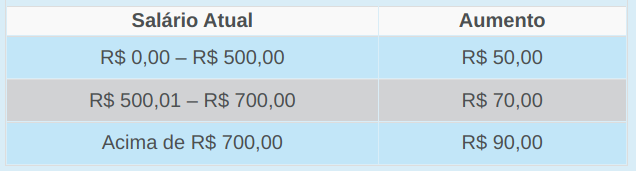

\tableofcontents

# Introdução

Esta é a nossa quinta aula do Curso de Introdução à Lógica de Programação. Nas aulas anteriores, vimos os conceitos de abstração e algoritmos. Na aula passada, estudamos os tipos de dados básicos, os conceitos de variáveis e constantes e aprendemos a criar e resolver expressões lógicas e aritméticas em algoritmos.

Nesta aula, abordaremos o conceito de Estruturas de Decisão em algoritmos e compreenderemos o funcionamento das principais estruturas de decisão: SE, SE/SENÃO e SELECIONE/CASO.

Até agora, estávamos acostumados a desenvolver algoritmos escrevendo instruções que eram executadas sequencialmente (ou seja, uma depois da outra). E se você quisesse que determinadas instruções do seu algoritmo fossem executadas somente se uma determinada situação ocorrer?

Nesta aula, aprenderemos como é importante estudar estruturas de decisão para a elaboração de algoritmos cada vez mais complexos.

Vamos começar a aula!

> Objetivos

> + Compreender o conceito de estruturas de decisão;
> + Representar e interpretar situações condicionais.
 
# 1. O emacs é daora

> Objetivos

> + Reconhecer estruturas de decisão em situações do mundo real;
> + Compreender a importância das estruturas de decisão em um algoritmo.

Na aula sobre algoritmos, conhecemos as suas características e como eles podem ser usados na hora de solucionar um problema. Relembrando: algoritmo é um conjunto de passos no qual se tem uma **entrada** que, ao ser processada, produzirá uma **saída**.

Durante as aulas, aprendemos que algoritmos fazem parte do nosso dia-a-dia e estão presentes desde uma simples receita de bolo até em sistemas de grandes empresas.

Até a aula de hoje, estávamos acostumados a escrever algoritmos em que um conjunto de passos era executado sequencialmente até encontrar a saída do algoritmo.

Somente executar passos sequencialmente não é suficiente para resolver determinados problemas mais complexos e é por isso que novas estruturas foram incorporadas aos algoritmos como, por exemplo, as **estruturas de decisão**.

As estruturas de decisão estão presentes no nosso cotidiano. É comum no nosso dia a dia tomarmos alguma decisão sobre algo que vamos fazer dada uma situação na qual nos encontramos. Vamos analisar dois diálogos entre João e Pedro para compreender melhor esse conceito.

{width=70%}
{width=70%}


No diálogo, vemos que se a resposta do João para a pergunta de Pedro for **Não**, Pedro decide que irão jogar bola. Caso a resposta seja **Sim**, Pedro e João ficarão em casa. Perceba que existiu um desvio no fluxo de ações de Pedro que optou por escolher um dos caminhos dependendo da resposta de João.

Que tal outro exemplo? Vamos analisar a figura 2. Júlia precisa ir para a casa de uma amiga estudar. Existem dois caminhos que chegam até a casa da amiga de Júlia. O caminho da direita tem distância de 5,3 Km passando por uma floresta com bastante sombra e o caminho da esquerda tem distância de 2 Km passando por um campo aberto.

{width=70%}

Vamos imaginar que Júlia precisa chegar o mais rápido possível na casa da amiga e não está preocupada se o caminho tem ou não sombra. Qual caminho ela deveria escolher? A resposta é: “O caminho da esquerda”.

Perceba que antes de escolher o caminho, uma **decisão** precisou ser tomada. A decisão foi baseada na condição de que “Julia deve gastar o menor tempo possível”. Diante disso, qual seria a pergunta que deveria ser feita para que a resposta influenciasse na decisão? Vamos analisar a figura a seguir.

{width=70%}

Os dois exemplos apresentados são baseados em situações do dia a dia. Com algoritmos não é diferente. Algoritmos necessitam de uma estrutura capaz de desviar a execução, ou seja, um fluxo de ações. Esses desvios deverão ocorrer sempre que uma decisão for tomada.

Essa estrutura é chamada de **Estrutura de Decisão** e é responsável por desviar o fluxo de execução de um algoritmo. Com a possibilidade de mudança de fluxo, podemos criar algoritmos mais robustos, capazes de fazer escolhas com base em uma condição. Esses algoritmos estarão aptos a resolver diversos tipos de problemas.

{width=50%}

Você se lembra dos fluxogramas? Eles são a representação gráfica de algoritmos. As estruturas de decisão podem ser representadas usando o fluxograma da figura 3.

A condição é representada por um losango. Se o resultado da **condição** for verdadeiro, o **bloco 1** será executado. Caso contrário (ou seja, a condição sendo falsa), o **bloco 2** será executado. Na aula passada, tínhamos algoritmos que sempre executavam passos sequenciais. Com essa nova estrutura, podemos ter algoritmos em que somente alguns comandos serão executados.

Nesse tópico, identificamos algumas situações no nosso cotidiano onde utilizamos estruturas de decisão. Além disso, aprendemos como representar uma estrutura de decisão em um fluxograma.

Existem três tipos de estruturas de decisão em algoritmos. São elas: SE, SE/SENÃO e SELECIONE/CASO. Cada uma possui uma forma de utilização e um propósito que veremos mais detalhadamente nos próximos tópicos da nossa aula.

No próximo tópico, iremos aprender como funciona a estrutura de decisão mais simples, a estrutura SE.

# 2. Estrutura de Decisão SE

> Objetivo

> + Compreender o funcionamento da estrutura de decisão SE.

No tópico anterior, percebemos a importância que as estruturas de decisão têm no nosso dia a dia e como elas são importantes para os algoritmos em geral. Vamos agora aprender como funciona a primeira e mais simples dessas estruturas: a do tipo SE.

{width=70%}

Estruturas de decisão do tipo SE compreendem apenas uma possibilidade: a da condição ser **verdadeira**. Elas são formadas pela regra apresentada na figura 4.

Vamos analisar a construção textual da estrutura de decisão SE. A primeira cláusula ou palavra-chave é a palavra “**se**”, seguida pela \<condição>. Essa condição equivale a uma expressão lógica ou relacional que será verificada. Logo após, temos a palavra-chave “**então**” seguida pelo \<bloco 1>. O que estiver dentro do bloco 1 será executado caso a \<condição> seja verdadeira. Para finalizar, fechamos com a cláusula “**fim_se**”.

A cláusula \<condição> representa qualquer expressão lógica ou relacional, ou seja, aquelas que tenham um valor lógico (verdadeiro ou falso), também conhecidos como booleanos. Vocês lembram o que são expressões booleanas? Vamos então lembrar um pouco.

## Revisão de Expressão Booleana

Expressão Booleana é uma estrutura lógica que pode ter um valor **verdadeiro** ou **falso**. As operações podem ser formadas por diversos operadores. A tabela 1, a seguir, contém alguns dos possíveis operadores de uma expressão booleana.

{width=70%}

A expressão contida na cláusula \<condição> pode ser montada usando números e/ou variáveis em um algoritmo. Exemplos:

> + 6 < 3 – “Seis é menor do que três”
> + media > 7 – “O valor da variável ‘media’ é maior do que 7”

Na tabela 2, a seguir, você encontrará mais exemplos de possíveis expressões que podem ser inseridas na cláusula \<condição>.

{width=70%}

Os algoritmos apresentados na aula 3 possuíam sempre um conjunto de passos que eram executados sequencialmente, ou seja, um depois do outro. E se dentre esses passos, você tivesse um comando que somente seria executado se alguma condição acontecesse? Para ajudar a entender melhor, vamos relembrar o algoritmo *Preparar Café da aula 3* e apresentar uma versão modificada, adicionando uma estrutura de decisão SE. Veja então como ficaria.

\vspace*{0.2cm}

> **`Algoritmo 1: Preparar Café`**

> `Variáveis:`  
> `Início`  

> > `Ferver a água`  
> > `Colocar pó de café na água`  
> > `Misturar bem para dissolver o pó na água`  
> > `Passar a mistura no filtro de café`  
> > **`se`** `João gosta de açúcar` **`então`**  

> > > `Adicionar açúcar ao café`  

> > **`fim_se`**  
> `Fim`  

\vspace*{0.2cm}

Perceba, nesse exemplo, que a operação “Adicionar açúcar ao café” somente será executada se a expressão “João gosta de açúcar” for **verdadeira**.

Vamos agora analisar outro exemplo: um algoritmo que verifica se o aluno foi aprovado em uma disciplina.

\vspace*{0.2cm}

```
Algoritmo 2: Aprovação em  Disciplina
Variáveis:
  notaDoAluno: Decimal
Início
  notaDoAluno = 8.0
  se notaDoAluno >= 7.0 então
    Aluno passou de ano
  fim_se
Fim
```

\vspace*{0.2cm}

A variável **notaDoAluno** está guardando o valor 8.0. A condição para o aluno passar de ano é ele ter nota com valor igual ou maior do que 7.0. Como 8.0 $\geq$ 7.0 então o comando Aluno passou de ano será executado.

## Abstração na Computação

Na computação, utilizamos a abstração não só como ferramenta para criar representação de objetos, mas também para simplificar problemas que desejamos resolver com ajuda do computador. Você lembra que no tópico 1 dissemos que o computador executa pequenas tarefas? Então, para fazer o computador resolver problemas complexos através de pequenas tarefas, precisamos quebrar os problemas em partes menores, usando o conceito de abstração.

O primeiro passo para simplificar um problema é identificar os elementos que fazem parte dele e criar as abstrações necessárias. Vejamos o seguinte exemplo:

> **Exemplo 1**

> Digamos que precisamos **desenhar um quadrado**. O que precisamos saber para resolver esse problema?

> 1. **Saber** o tamanho do lado do quadrado (quadrados tem a mesma medida para todos os lados);
> 2. **Desenhar** uma linha reta, dado a sua medida.

As estruturas de decisão podem ocorrer em vários lugares no algoritmo e de diversas formas. Vamos analisar agora o algoritmo 4 e identificar as várias estruturas de decisão presentes.

\vspace*{0.2cm}

```
Algoritmo 4
Variáveis:
  a, b: Inteiro
Início
  a = 10
  b = 10
  b = b + 5
  se  b == 20 && a == 10 então
    b = 0
  fim_se
  se  a == 10 então
    a = 0
  fim_se
Fim
```

\vspace*{0.2cm}

No algoritmo 4, temos duas estruturas de decisão do tipo SE com condições totalmente diferentes e cada uma executa um comando específico. Você sabe dizer quais são os valores no final da execução das variáveis a e b? A resposta é: a=0 e b=15.

O primeiro bloco de decisão não é executado. Vamos entender por quê? O primeiro bloco é composto por duas expressões booleanas unidas por um operador “&&” (esse símbolo significa “E”, ou seja, para que a expressão completa seja verdadeira, todas as partes que a compõe devem ser verdadeiras).

Vamos dividir a expressão completa em duas expressões menores para facilitar o entendimento:

> > **Expressão 1**: b == 20 → falso

> > **Expressão 2**: a == 10 → verdadeiro

Apesar da variável “a==10” possuir valor **verdadeiro**, a expressão “b==20” é **falsa**, pois a variável b guarda o valor **15** e não o valor 20. Juntando as duas expressões com o operador “&&” da expressão original temos:

> > **Expressão 1** && **Expressão 2** →  falso && verdadeiro → **falso**

Como a condição no final gera uma expressão que possui valor **falso**, o bloco “b==10” não será executado.

A segunda estrutura de decisão presente no algoritmo possui uma condição mais simples:

> > a == 10  → **verdadeiro**

Como a variável a (que guarda o valor 10 na execução da segunda estrutura de decisão), a condição retornou **verdadeiro** substituindo assim o valor da variável a de 10 por 0. No final, as variáveis possuem valores de a=0 e b=15 como resposta para o algoritmo.

Nesse tópico, estudamos a primeira estrutura de decisão, SE, e sua aplicação em vários exemplos de algoritmos e aprendemos a identificar as estruturas de decisão em algoritmos.

No próximo tópico, iremos aprofundar um pouco mais nas estruturas de decisão e onde aprenderemos a estrutura SE/SENÃO e o seu uso em vários exemplos. Além disso, aprenderemos também como usar o aninhamento de estruturas de decisão.

# 3. Estrutura de Decisão SE/SENÃO

> Objetivos

> + Compreender o funcionamento da estrutura de decisão SE/SENÃO;
> + Identificar os casos onde cabe aninhamento de SE e SE/SENÃO.

No tópico anterior, aprendemos o funcionamento da estrutura de decisão SE e sua aplicação em vários algoritmos. Aprendemos que o bloco presente em \<bloco 1> somente será executado se o bloco \<condição> retornar algum valor **verdadeiro**.

Mas se nós quiséssemos que alguma instrução fosse executada apenas se o bloco \<condição> retornasse **falso**? Para resolver esse problema, estudaremos, neste tópico, a estrutura de decisão SE/SENÃO.

A estrutura de decisão SE/SENÃO está apresentada na figura 5:

Para essa nova estrutura, uma nova palavra-chave foi acrescentada: a palavra “**senão**”. Sempre que a \<condição> retornar um valor **verdadeiro**, o \<bloco 1> será executado, e sempre que a \<condição> retornar um valor **falso**, o \<bloco 2> será executado. Como foi visto no tópico anterior, a palavra-chave **fim_se** encerra a estrutura.

{width=70%}

Vamos retomar o algoritmo Preparar Café? Imaginemos a seguinte situação: uma pessoa com diabetes (doença que interfere na capacidade do corpo de absorver açúcar) deve evitar ao máximo consumir açúcar no seu dia-a-dia. Então, como poderíamos alterar o algoritmo para que o mesmo se comportasse diferente caso o consumidor não pudesse consumir açúcar? Vamos então alterar o algoritmo!

Podemos perceber que o bloco Adicionar adoçante ao café será executado somente se a condição João tem diabetes retornar **verdadeiro**. Caso a afirmação retorne **falso**, o bloco Adicionar açúcar ao café será executado. Simples, não é? O mesmo vale para algoritmos com valores e variáveis.

```
Algoritmo 5: Preparar Café SE/SENÃO
Variáveis:
Início
  Ferver a água
  Colocar pó de café na água
  Misturar bem para dissolver o pó na água
  Passar a mistura no filtro de café
  se João tem diabetes então
    Adicionar adoçante ao café
  senão
    Adicionar açúcar ao café
  fim_se
Fim
```

Vejamos outro exemplo para fixar o que estudamos sobre a estrutura SE/SENÃO. Olhando agora para o algoritmo 6, ao lado, quais seriam os valores finais das variáveis a e b?


```
Algoritmo 6
Variáveis:
  a, b: Inteiro
Início
  a = 10
  b = 10
  b = b + 5
  se  b == 20 então
    b = 0
  senão
    b = 30
  fim_se
Fim
```

A resposta é a = 10 e b = 30. Veja que ao executar a condição “b == 20”, o valor final é **falso**, pois a variável b guarda o valor 15. Como a expressão retornou **falso**, o bloco “b=30” será executado fazendo com que a variável b guarde o valor 30.

## Estruturas de Decisão Aninhadas

Agora que já aprendemos como funciona a estrutura de decisão SE/SENÃO, vamos analisar a seguinte situação: imagine que você vai desenvolver um algoritmo de saques em caixas eletrônicos. O banco no qual você trabalha determinou que saques realizados durante o horário comercial (ou seja, entre 06:00 e 22:00) podem ser feitos no valor de no **máximo** R$ 5.000,00. Qualquer saque realizado fora desse período deve ser de no **máximo** R$ 400,00. Como poderíamos formular esse algoritmo respeitando as restrições dadas no problema?

Para resolver esse problema, iremos precisar de **estruturas de decisão aninhadas**, ou seja, estruturas de decisão alocadas hierarquicamente, uma dentro de outra. Nesse caso, para que um bloco de comandos seja executado, todas as \<condições> das estruturas de decisão que levam até ele devem ser verdadeiras.

> Devemos utilizar estruturas de decisão aninhadas em um algoritmo sempre que quisermos que um bloco de instruções seja executado depois que **várias** condições sejam satisfeitas, ou seja, retornem o valor **verdade**.

É bem fácil compreender o uso da estrutura de decisão aninhada observando a figura 6. Ela ilustra duas estruturas SE/SENÃO encadeadas.

Observando a estrutura exemplificada na figura ao lado, podemos concluir que o \<bloco 1> somente será executado, se e somente se, \<condições 1> e \<condições 2> retornarem valores **verdadeiros**. Caso \<condições 1> retorne **verdadeiro** e \<condições 2> retorne **falso**, o \<bloco 2> será executado. E, por fim, caso \<condições 1> retorne **falso**, o \<bloco 3> será executado. Observe o esquema a seguir para compreender melhor o uso dessa estrutura:

*Video 1*

```
se <condições 1> então
  se <condições 2> então
    <bloco 1>
  senão
    <bloco 2>
  fim_se
senão
  <bloco 3>
fim_se
```

Qualquer um dos blocos (bloco 1, 2 e 3) pode conter uma ou mais estruturas de decisão como, por exemplo, estruturas de decisão SE, vistas no tópico 2 desta aula.

Voltemos, então, para a situação descrita no início deste tópico. Como podemos então representar o algoritmo de saques em caixas eletrônicos? Uma possível solução poderia ser:

```
Algoritmo 7: Caixa  Eletrônico 
Variáveis:
  hora: Inteiro
  valor: Decimal
Início 
  se  hora >= 6 E hora <= 22 então
    se valor <= 5000 então
      Saque realizado com sucesso!
    senão
      Valor não pode ser sacado!
    fim_se
  senão
    se valor <= 400 então
      Saque realizado com sucesso!
    senão
      Valor não pode ser sacado!
    fim_se
  fim_se
Fim
```
De acordo com o algoritmo 7, a estrutura de decisão mais externa (cuja condição é “hora >= 6 && hora <= 22“) identifica o horário que o saque está sendo realizado. As outras estruturas de decisão verificam se a quantidade sacada pelo usuário respeita a quantidade máxima permitida para o horário.

Existem somente duas situações onde o saque pode ser realizado com sucesso. A primeira é quando ambas as condições hora >= 6 && hora <= 22” e “valor <= 5000” retornam **verdadeiro**. A outra é quando “hora >= 6 && hora <= 22” retorna **falso** e “valor <= 400” retorna **verdadeiro**.

As situações em que o cliente não pode sacar o valor são: quando a condição “hora >= 6 && hora <= 22” retorna **verdadeiro** e a condição “valor <= 5000” retorna **falso** e quando ambas as condições, “hora >= 6 && hora <= 22” e “valor <= 400”, retornam **falso**.

Uma empresa resolveu conceder um aumento ao seus funcionários de acordo com a seguinte tabela:

{width=70%}

Meu algoritmo:

```
Algoritmo quiz
Variáveis:
    Salário:decimal
Início:
    ENTRADA(salario)
    se salario <= 700,00 então
        se salario <= 500,00 então
            salario += 50
        senão
            salario += 70
        fim_se
    senão
        salario += 90,00
    fim_se
    SAIDA(salario)
Fim
```

Nesse tópico, aprendemos a utilizar estruturas de decisão SE/SENÃO em algoritmos buscando, através de exemplos, explicar o seu funcionamento e sua importância na construção de algoritmos que executam operações, caso uma condição seja **falsa**.

Além disso, estudamos as estruturas de decisão aninhadas e sua aplicação. Aprendemos que podemos ter estruturas de decisão organizadas hierarquicamente testando várias situações antes que um comando seja executado.

No próximo tópico, estudaremos as estruturas de decisão CASO/SELECIONE que têm como objetivo executar comandos de acordo com o valor de uma variável.

# 4. Estrutura de Decisão SELECIONE/CASO

> Objetivo

> + Compreender o funcionamento da estrutura de decisão SELECIONE/CASO.

No tópico anterior, estudamos como estruturas de decisão podem ser aninhadas de forma hierárquica e como funciona a sua execução em um algoritmo. Neste tópico, aprenderemos o funcionamento da estrutura de decisão SELECIONE/CASO que tem como objetivo alterar o fluxo de execução de acordo com o valor de uma variável.

Nos tópicos anteriores, aprendemos que, para um bloco de comandos ser executado, uma ou mais condições deveriam ser satisfeitas, ou seja, deveriam possuir um valor **Verdadeiro**. As condições eram formadas por expressões lógicas que poderiam retornar verdadeiro ou falso e, assim, executar ou não o bloco de comandos.

{width=70%}

Vamos agora analisar a seguinte situação: os dias da semana podem ser representados por números, começando no domingo com o valor 1 e terminando no sábado com o valor 7. O algoritmo a seguir define os passos necessários para que, dado um valor, possamos descobrir a qual dia da semana ele corresponde.

Você observou a quantidade de estruturas de decisão SE utilizadas para verificar o valor que a variável *dia* guarda para definir qual o dia da semana? É um total de sete comandos SE verificando qual o valor da variável *dia*.

A estrutura de decisão SELECIONE/CASO surge, então, para solucionar o problema de vários comandos SE, verificando o valor de uma variável em um algoritmo. O objetivo dessa estrutura é executar algum bloco de comandos dado o valor de uma variável. Vamos então entender a sua estrutura:

{width=70%}

A estrutura SELECIONE/CASO é iniciada pela palavra-chave “selecione” seguida da **variável** que se deseja verificar o valor. Depois, declaramos todos os valores que desejamos verificar, iniciando com a palavra-chave “caso”, seguido do **valor** da variável. Por fim, temos o bloco definido pela palavra-chave “padrão”.

> O bloco “padrão” é **opcional**, ou seja, é colocado somente se for necessário no algoritmo. Se nenhum dos blocos anteriores forem executados (ou seja, cada caso retornou falso), esse bloco será executado.

Analisando a figura 7, temos o seguinte:

> Se a variável **var** guardar o valor **1**, então será executado o \<bloco 1>.
> Se a variável **var** guardar o valor **2**, então será executado o \<bloco 2>.
> Se a variável **var** guardar o valor **3**, então será executado o \<bloco 3>.
> Se a variável **var** guardar qualquer valor diferente de 1,2,3 (ou seja, “caso 1”,”caso 2” e “caso 3” retornaram falso) será executado o \<bloco 4>.

{width=70%}

Que tal nós reescrevermos o algoritmo 7 utilizando, agora, a estrutura SELECIONE/CASO? Veja, então, como ele ficaria:

{width=50%}

Veja que, além de não repetir demasiadamente a estrutura de decisão SE, o código ficou bastante limpo e de fácil manutenção.

Por exemplo, caso a variável *dia* guarde o valor 5, o algoritmo retornará “Hoje é quinta-feira” e caso a variável *dia* guarde o valor 10, o algoritmo não executará nenhum “caso” (pois todas retornam **falso**) e retornará “Não foi possível identificar o dia”, pois nesse algoritmo existe o bloco definido pela palavra-chave **padrão**.

Se, no algoritmo, não tivesse o bloco **padrão**, o que aconteceria? Simples, nada iria acontecer e nenhum comando seria executado pelo algoritmo.

Para fixar os conhecimentos, vamos analisar outro algoritmo que utilize a estrutura de decisão SELECIONE/CASO? Qual será o valor que a variávelprecoProduto guarda no final do algoritmo ao lado?


```
Algoritmo 9
Variáveis:
  precoProduto,valorImposto: Decimal 
  estadoCliente: Inteiro
Início
  precoProduto = 10
  estadoCliente = 2
  valorImposto = 0;
  selecione estadoCliente
    caso 1
      valorImposto = 0.2
    caso 2
      valorImposto = 0.4
    caso 3
      valorImposto = 0.3
    padrão
      valorImposto = 0.1
  fim_selecione
  valorImposto += 1
  precoProduto = precoProduto * valorImposto 
Fim
```

No final do algoritmo, a variável precoProduto guarda o valor 14. Como chegamos a esse valor? Inicialmente, a variável estadoCliente guarda o valor 2. Na estrutura de decisão SELECIONE/CASO, existe um “caso 2” e, portanto, o comando valorImposto = 0.4 será executado. Por fim, o algoritmo executa o comando valorImposto += 1” e precoProduto = precoProduto * valorImposto chegando então ao valor 14.

A lógica que descrevemos nesse exemplo chama-se **lógica “OU”** e corresponde à seguinte descrição: o resultado é sempre verdadeiro (1), exceto se **todas** as condições forem falsas.

Podemos resumir o comportamento das operações lógicas “E” e “OU” baseados na sua tabela verdade.

> Tabela 8 – Tabelas verdade das operações “E” e “OU”
> *(Não peguei porque é a tabela e/ou que eu já conheço muito bem)

> Concluímos a quinta aula do Curso de Introdução à Lógica de Programação. Nela ampliamos o nosso conhecimento aprendendo mais sobre estruturas de decisão SE, SE/SENÃO e SELECIONE/CASO. Vimos que as estruturas de decisão estão presentes no nosso dia a dia nas mais diversas situações e aprendemos a identificar e utilizar essas estruturas em algoritmos.

> Usar as estruturas de decisão é o primeiro passo para se construir algoritmos cada vez mais complexos e, com isso, resolver os mais diversos problemas. Agora imaginem a situação onde vocês precisam que um conjunto de comandos seja executado um número finito (ou infinito) de vezes? Na próxima aula, aprenderemos sobre estruturas de repetições. Não percam!

