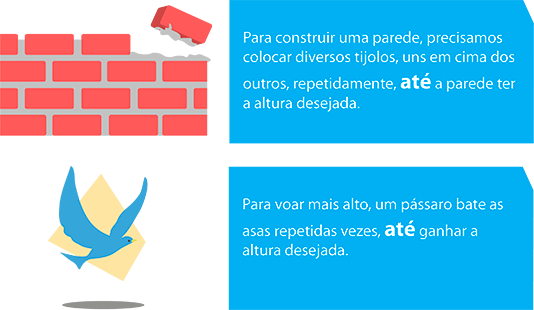
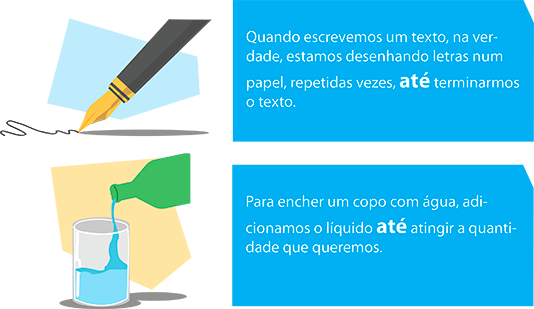
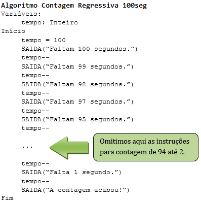
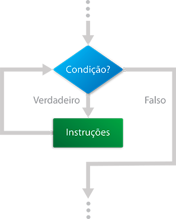
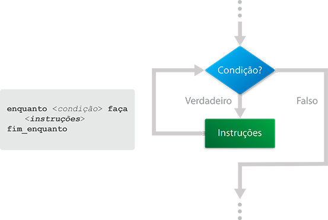

\tableofcontents

# Introdução

Caro(a) aluno(a),

Em aulas anteriores, estudamos como construir um algoritmo, definição de variáveis, entrada e saída de dados e estruturas de decisão. Todos esses conhecimentos já são suficientes para que você crie algoritmos para resolver muitos problemas.

Nesta aula, conheceremos as estruturas de repetição ENQUANTO e PARA, que nos permitem repetir blocos de instruções quando uma certa condição for válida. Essas estruturas nos ajudam a construir algoritmos mais curtos e inteligentes. Vamos começar?

> Objetivos

> + Compreender o conceito de estrutura de repetição;
> + Aprender a utilizar as estruturas de repetição ENQUANTO e PARA.

# 1. O que são estruturas de repetição?

> Objetivos
> + Reconhecer estruturas de repetição em situações reais;
> + Entender a relação entre estruturas de decisão e de repetição.

Neste tópico, compreenderemos o conceito de estrutura de repetição e identificaremos casos clássicos de repetição em atividades do dia a dia. Também veremos qual a relação entre estruturas de repetição e decisão.

Para começar, uma pergunta simples: o que é repetir? Repetir é executar uma mesma tarefa diversas vezes. Podemos identificar repetições em praticamente tudo o que fazemos ou acontece ao nosso redor. Vamos identificar alguns exemplos?

{width=70%}

Vejamos outros exemplos:

{width=70%}

Percebeu algo em comum entre todos os exemplos que citamos? Notou o destaque da palavra “até”? Todos os exemplos são formados por passos que se repetem até um certo momento, ou seja, existe um critério de parada. Reconhecida essa característica, podemos dizer que uma **estrutura de repetição consiste em um conjunto de passos que se repetem, subordinados à uma condição de parada.**

As estruturas de repetição também são conhecidas por laços (do inglês, loop), por representar uma rotina, algo que tem ciclos, que se repete. Você poderá encontrar esse assunto com o nome “laços” em diversos livros e tutoriais na Internet.

Antes de aprender a usar os laços (estruturas de repetição), vamos entender por que eles existem. Considere um algoritmo a seguir que faz uma contagem regressiva e mostra uma mensagem de encerramento:

```
Algoritmo Contagem Regressiva 3seg
Variáveis:
     tempo: Inteiro
Início
     tempo = 3
     SAIDA(“Faltam 3 segundos.”)
     tempo--
     SAIDA(“Faltam 2 segundos.”)
     tempo--
     SAIDA(“Falta 1 segundo.”)
     tempo--
     SAIDA(“A contagem acabou!”)
Fim
```

O algoritmo Contagem Regressiva 3seg é bem simples e você pode facilmente imaginar onde ele pode ser usado: cronômetros, alarmes de telefone celular, temporizador de forno micro-ondas etc. Mas esse algoritmo tem uma limitação: seu tempo está fixo em 3 segundos. E se nós quiséssemos que ele contasse regressivamente uma quantidade maior de tempo, como por exemplo, 100 segundos? Ele ficaria assim (veja figura ao lado):

{width=70%}

Depois de ler o algoritmo da contagem de 100 segundos, você deve ter percebido que, se o tempo de contagem aumentar, o número de instruções também aumenta. Isso significa que esse algoritmo pode ter dois problemas:

+ Se precisarmos contar um tempo ainda maior, como 200 segundos, o algoritmo ficaria muito grande.

+ Imagine o caso em que o usuário possa definir o tempo de contagem usando a instrução ENTRADA. Não saberemos quantos segundos será necessário contar e, portanto, não saberemos quantas instruções o algoritmo deve ter.

No algoritmo da contagem regressiva **algumas instruções se repetem** (a saída da mensagem de segundos restantes e o decremento do tempo) e **existe uma condição de parada** (tempo ser igual a 0). Esse é um caso típico de aplicação de uma **estrutura de repetição.**

> Uma estrutura de repetição reduz uma grande quantidade de instruções repetidas a um pequeno bloco, tornando o algoritmo menor e mais fácil de ler.

Se usarmos uma estrutura de repetição para o algoritmo de contagem regressiva, podemos reduzir o controle da contagem para poucas linhas, independentemente do tempo definido para contagem. Veremos como fazer isso de duas formas diferentes nos próximos tópicos, mas podemos dizer, de antemão, que as estruturas de repetição têm a seguinte forma:

Modelo de uma estrutura de repetição

```
nome_da_estrutura condição_de_continuidade 

  bloco_de_instruções

fim_estrutura
```

Para construir uma estrutura de repetição, basta:

+ Identificarmos as instruções que se repetem e colocá-las na seção bloco_de_instruções

+ Identificarmos as condições para o que a repetição continue e colocá-las na seção condição_de_continuidade.

Quando um algoritmo encontra uma estrutura do tipo da figura 1, ele repete o bloco de instruções até que a condição de continuidade se torne falsa. O fluxograma a seguir ilustra o funcionamento das estruturas de repetição:

{width=50%}

Identificar a condição de parada da repetição de instruções é fundamental, pois ela corresponde à negação da condição de continuidade que será usada no algoritmo. Vejamos alguns exemplos no quadro 1:


Percebeu que a condição de continuidade é exatamente o contrário da condição de parada? Como o que interessa para uma estrutura de repetição é que o bloco de instruções continue sendo repetido até um certo momento, usamos uma **condição de continuidade**. Enquanto ela for verdadeira, as instruções se repetem. Quando ela se tornar falsa, a repetição para.

A cada teste de continuidade, seguido de uma execução do bloco de instruções, damos o nome de **iteração**. Assim, podemos nomear cada repetição como iteração 1, iteração 2, iteração 3 e assim por diante. Identificar cada iteração, às vezes, nos ajuda a entender como a estrutura de repetição está funcionando e a detectar falhas.

> Tenha cuidado para não confundir os termos **iteração** e **interação**. Iteração corresponde a uma execução do bloco de instruções de uma repetição. Já interação tem relação com contato entre duas partes, por exemplo, quando uma pessoa usa um computador, essa ação recebe o nome de interação homem-computador; quando duas pessoas estão conversando ou discutindo uma ideia, podemos dizer que elas estão interagindo.

## Estruturas de decisão x estruturas de repetição

Depois de analisar o formato de uma estrutura de repetição, podemos chegar à conclusão de que ela corresponde a uma estrutura de decisão, como o SE, que tem a capacidade de se testar vez após vez, enquanto a condição de continuidade for verdadeira.

As estruturas de repetição se beneficiam da ideia das estruturas de decisão para executar blocos de instruções várias vezes. A figura 3 ilustra bem esse conceito:

{width=85%}

Chegamos ao final do tópico 1. Conhecemos o conceito de estrutura de repetição e a sua função em um algoritmo. Vimos que estruturas de repetição são indicadas para substituir uma grande quantidade de passos repetidos, diminuindo o tamanho do algoritmo. Vimos também que precisamos conhecer a condição de continuidade da repetição e que ela é exatamente o oposto da condição de parada. No tópico seguinte, conheceremos a estrutura de repetição ENQUANTO.

# 2. Estrutura de repetição ENQUANTO

> Objetivo

> + Compreender o funcionamento da estrutura de repetição ENQUANTO.

No tópico anterior, conhecemos as características de uma estrutura de repetição e a sua função em um algoritmo. Neste tópico, estudaremos a estrutura de repetição ENQUANTO.

A estrutura de repetição ENQUANTO é idêntica ao modelo genérico que descrevemos no tópico anterior (figura 2). Observe o modelo de código e fluxograma dessa estrutura na figura 4 a seguir:

{width=70%}

Vejamos um exemplo de uso da estrutura de repetição ENQUANTO em um algoritmo. Imagine que você foi a um parque de diversões e resolveu brincar em uma barraca de lançamento de argolas, daquelas em que você tenta encaixar argolas em pinos ou garrafas para ganhar um prêmio. Seu objetivo é acertar o maior número de garrafas ou pinos dentro do tempo estipulado pelo coordenador da brincadeira e com 20 argolas. Qual seria o algoritmo para fazer essa brincadeira?

{width=60%}

Note, na linha 7, que a condição de continuidade para essa estrutura de repetição ENQUANTO é formada por duas partes: o jogador precisa ter argolas na mão para jogar e o tempo da brincadeira não pode ter se esgotado. Em outras palavras, enquanto o jogador tiver tempo e argolas, ele pode continuar lançando as argolas para tentar encaixá-las nas garrafas ou pinos.

Como você deve ter percebido no algoritmo Brincadeira de Argolas, a condição de continuidade do ENQUANTO é formada por duas partes conectadas pelo operador lógico && (“E”). Você pode conectar diversas condições pequenas e formar uma expressão complexa para controlar o laço ENQUANTO, contanto que o resultado da expressão seja do tipo Lógico, ou seja, verdadeiro ou falso.

```
01 Algoritmo Brincadeira de Argolas
02 Variáveis:
03     qtd_argolas: Inteiro
04     tem_tempo: Lógico
05 Início    
06     qtd_argolas = 20 
07     ENQUANTO qtd_argolas > 0 && tem_tempo == Verdadeiro FAÇA
08          jogar argola
09          qtd_argolas--
10     FIM_ENQUANTO
11 Fim
```

Que tal agora remodelarmos o algoritmo da contagem regressiva do tópico anterior para usar a estrutura de repetição ENQUANTO? Ele ficará como o algoritmo a seguir.

*VER VIDEO ANIMACAO01*

Vamos analisar o algoritmo a seguir:

```
01 Algoritmo Contagem Regressiva ENQUANTO
02 Variáveis:
03     tempo: Inteiro
04 Início
05     ENTRADA(tempo)    
06     ENQUANTO tempo > 0 FAÇA 
07          SAIDA(“Faltam ”, tempo, “ segundo(s).”)
08          tempo--
09     FIM_ENQUANTO
10 Fim
```

Utilizamos a instrução ENTRADA para obter um valor para a variável tempo, fornecido pelo usuário. Depois, chegamos à estrutura de repetição ENQUANTO, na linha 6. Se o valor da variável tempo for maior que zero, as instruções das linhas 7 e 8 serão executadas.

Ao alcançar a instrução FIM_ENQUANTO, o algoritmo retorna à linha 6 e analisa a condição tempo > 0 novamente. Caso a condição continue verdadeira, as linhas 7 e 8 serão executadas de novo e assim por diante. Quando a condição tempo > 0 se tornar falsa, a repetição é finalizada e a instrução da linha 10 será executada.

```
01 Algoritmo Conversão Decimal para Binário
02 Variáveis:
03     valor_dec, resto: Inteiro
04 Início
05     SAIDA(“Informe um valor decimal”)
06     ENTRADA(valor_dec)
07     ENQUANTO valor_dec >= 1 FAÇA
08          resto = valor_dec % 2
09          SAIDA(resto) 
10          valor_dec = valor_dec / 2 
11     FIM_ENQUANTO
12 SAIDA(valor_dec)
13 Fim
```
        
Vejamos outro exemplo. O algoritmo a seguir faz o processo de sucessivas divisões por 2, utilizado na conversão de um número em sistema decimal para binário, e exibe o resultado, um dígito por vez. Os dígitos exibidos como saída do algoritmo representam o número binário resultante da conversão na ordem inversa, ou seja, se o número for 0101, o resultado exibido será 1010.

Nesse segundo exemplo, a variável valor_dec é preenchida através do comando ENTRADA e, em seguida, é utilizada na condição de continuidade do ENQUANTO, na linha 7. O bloco de instruções desse ENQUANTO calcula e exibe o resto da divisão de valor_dec por 2 (linhas 8 e 9) e divide valor_dec pela metade (linha 10). Quando o valor de valor_dec chega a 1 ou menos, a condição de continuidade do ENQUANTO acaba. Tente executar o algoritmo mentalmente para valores pequenos como 7 (111 em binário) ou 8 (1000 em binário) e verifique se ele funciona como esperado.

## Controle do valor de variáveis usando ENQUANTO

```
01 Algoritmo Laço Infinito
02 Variáveis:
03     contador: Inteiro
04 Início
05     SAIDA(“Informe um valor decimal”)
06     contador = 0
07     ENQUANTO contador <= 50 FAÇA
08          SAIDA(contador)
09     FIM_ENQUANTO     
10 Fim 
```
        
Vimos alguns exemplos do uso da estrutura ENQUANTO. É importante notar que a estrutura ENQUANTO apenas repete o teste de continuidade e executa o bloco de instruções que precisam se repetir, mas o controle de valor de variáveis fica a cargo da pessoa que escreveu o algoritmo.

A falta de atenção à esse detalhe causa problemas de repetições infinitas, também chamados de **laços infinitos**. Por exemplo, no algoritmo a seguir a estrutura ENQUANTO nunca terminará, pois o valor da variável contador não está sendo modificado.

> Fique sempre atento ao controle de valor das variáveis dentro do bloco de instruções do ENQUANTO. Você precisará que as variáveis usadas na condição da estrutura de repetição tenham seus valores atualizados.

```
01 Algoritmo Primeiros 10 Múltiplos de 3
02 Variáveis:
03     contador, numero: Inteiro
04 Início
05     SAIDA(“10 primeiros múltiplos de 3: ”)
06     contador = 0
07     numero = 1
08     ENQUANTO contador < 10 FAÇA 
09          SE numero % 3 == 0 ENTÃO
10               SAIDA(numero)
11               contador++
12          FIM_SE
13          numero++
14     FIM_ENQUANTO     
15 Fim
```

(sobre o algoritmo acima) Quando a variável contador alcançar o valor 10, o laço ENQUANTO pode ser encerrado e já terão sido encontrados os 10 primeiros múltiplos de 3. 

O algoritmo a seguir tem como objetivo capturar números digitados pelo usuário e somá-los até um valor limite igual a 100. Quando esse valor for alcançado ou ultrapassado, o laço ENQUANTO deve ser finalizado.

```
01 Algoritmo Soma Até 100
02 Variáveis:
03   valor, total: Inteiro
04   limite_alcancado: Lógico
05   Início
06      total = 0
07      abaixo_do_limite = Verdadeiro
08      ENQUANTO abaixo_do_limite == Verdadeiro
        FAÇA 
09         SAIDA(“Informe um valor: ”)
10         ENTRADA(valor)
11         total += valor
12         SAIDA(“Total acumulado = ”, total)
13         abaixo_do_limite = total < 100
14      FIM_ENQUANTO     
15 Fim
```

Quando o valor da variável total alcançar ou ultrapassar o valor 100, a variável abaixo_do_limite receberá valor Falso e o laço será finalizado.

Chegamos ao fim desse tópico. Estudamos a estrutura de decisão ENQUANTO, que permite a repetição de um bloco de instruções baseado em uma condição de continuidade. Vimos que quando a condição se torna falsa, a estrutura de repetição é encerrada e as demais instruções do algoritmo são executadas normalmente.

No próximo tópico conheceremos a estrutura de repetição PARA, que é um pouco mais complexa que o ENQUANTO, mas oferece algumas facilidades no controle da variável usada na condição de continuidade.

# 3. Estrutura de repetição PARA

> Objetivos

> + Compreender o funcionamento da estrutura de repetição PARA;
> + Identificar situações em que usar PARA em vez de ENQUANTO, torna-se mais adequado.

No tópico anterior, conhecemos a estrutura de repetição ENQUANTO. Vimos que o ENQUANTO permite que um bloco de instruções do algoritmo seja repetido diversas vezes sem a necessidade de ser reescrito e que essa repetição é baseada em uma condição de continuidade.

Agora vamos conhecer a estrutura de repetição PARA (do inglês for). Essa estrutura tem a mesma função do ENQUANTO, que é repetir instruções com base em uma condição, mas tem um formato voltado para o uso exclusivo de uma única variável numérica.

Em resumo, a estrutura PARA faz uma contagem crescente ou decrescente em passos e, para cada passo, executa o bloco de instruções que deve ser repetido. Para efetuar a contagem, uma variável do tipo Inteiro é necessária. Observe o modelo de código e fluxograma da estrutura PARA na figura 6 a seguir:

{width=85%}

## Precedência entre operadores

Como você pôde ver na figura 6, a estrutura PARA possui três valores de referência: v1 (valor inicial da contagem), v2 (valor final da contagem) e v3 (passo de incremento/decremento da contagem). Entenda cada um deles no exemplo da animação a seguir.

*VER VIDEO animacao02.mp4*

O valor do PASSO (ver figura 6) na estrutura de repetição PARA pode ser tanto positivo como negativo, sendo possível, assim, fazer contagens crescentes ou decrescentes. Além disso, é possível usar valores maiores que um para o passo.

Vejamos um outro exemplo da estrutura PARA explorando uma contagem decrescente de passo igual a -3. Ele simula o trabalho de um limpador de janelas em um prédio, que começa pela janela do 5º andar e segue descendo de 3 em 3 metros para alcançar a janela do andar inferior.

```
01 Algoritmo Limpador de Janelas
02 Variáveis:
03     andar, altura: Inteiro
04 Início
05     andar = 5
06     PARA altura de 15 até 3 PASSO -3 
07          SAIDA(“Limpando janela do andar ”, andar)
08          SAIDA(“Altura atual: ”, altura, “m”) 
19          andar--
10     FIM_PARA
11 Fim
```

A saída gerada para o algoritmo Limpador de Janelas é:

```
Limpando janela do andar 5
Altura atual: 15m
Limpando janela do andar 4
Altura atual: 12m
Limpando janela do andar 3
Altura atual: 9m
Limpando janela do andar 2
Altura atual: 6m
Limpando janela do andar 1
Altura atual: 3m
```

> Lembre-se de definir o passo da estrutura PARA de acordo com o tipo de contagem que está executando, ou seja, valores positivos de PASSO para contagens crescentes e valores negativos para contagens decrescentes. Caso contrário, sua contagem não chegará ao valor final e se torna um laço infinito.

```
01 Algoritmo Números pares de 0 a 100
02 Variáveis:
03    x: Inteiro
04 Início
05   SAIDA(“Numeros pares de 0 a 100: ”)
06   PARA x DE V1 = 0 ATÉ V2 = 100 PASSO V3 = 2
07      SAIDA(x)
08   FIM_PARA     
09 Fim
```

Esses três valores (V1, V2, V3) farão o algoritmo exibir os números pares de 0 a 100.

## Laço PARA x ENQUANTO

Agora que você já conhece as estruturas de repetição ENQUANTO e PARA, pode estar se perguntando: quando devo usar uma ou outra?

As estruturas ENQUANTO e PARA têm como objetivo a repetição de instruções. Porém, o controle da condição de repetição do ENQUANTO é bem mais livre que a do PARA. A condição do ENQUANTO pode ser uma **expressão lógica ou relacional** qualquer. Já o PARA sempre controla a repetição com base em uma contagem numérica, usando uma variável do tipo Inteiro.

Embora a estrutura PARA pareça menos interessante por ser limitada à contagem numérica, ela é bastante útil pois esse tipo de controle de repetição é o mais comum no desenvolvimento de algoritmos. Diversas tarefas utilizam uma contagem simples, crescente ou decrescente como condição para repetição de instruções, por exemplo:

+ Exibir uma lista de nomes, sabendo a quantidade deles
+ Efetuar a soma de parcelas de uma compra, sabendo a quantidade delas
+ Aguardar um determinado tempo em segundos (contar de 0 a 10s, por exemplo)

A estrutura PARA também inclui uma sessão chamada PASSO, que efetua o incremento/decremento automático do valor da variável de controle, eliminando uma instrução de dentro do bloco de instruções a ser repetido.

Se o seu algoritmo precisa de uma repetição de instruções que não se encaixa perfeitamente como uma contagem, ou que é uma contagem na qual os passos de incremento/decremento não são constantes (por exemplo: a variável usada no controle aumenta 3 unidades na primeira iteração, 2 unidades na segunda, 5 unidades na terceira etc.), o mais indicado é usar a estrutura ENQUANTO.

Tenha sempre em mente que uma estrutura PARA pode ser substituída sem prejuízo de lógica por uma estrutura ENQUANTO. Basta escrever as instruções de definição do valor inicial, teste de valor final e incremento/decremento da variável de controle manualmente, como no exemplo a seguir.

```
01 Algoritmo Contagem com PARA
02 Variáveis:
03     x: Inteiro
04 Início
05     PARA x de 0 até 20 PASSO 2
06          SAIDA(x) 
07     FIM_PARA
08 Fim
```

```
01 Algoritmo Contagem com ENQUANTO 
02 Variáveis:
03     x: Inteiro
04 Início
05     x = 0
06     ENQUANTO x < = 20 FAÇA 
07          SAIDA(x)  
08          x = x + 2
09     FIM_ENQUANTO
10 Fim
```
> Chegamos ao final da nossa aula e aqui concluímos os nossos estudos sobre estruturas de repetição. Conhecemos as estruturas ENQUANTO e PARA, que permitem a execução de blocos de instruções múltiplas vezes, baseados em uma condição de continuidade, como uma contagem ou valor de uma expressão lógica.

> Na próxima aula, estudaremos uma técnica chamada de modularização. A modularização permite que criemos blocos de instruções, chamados de módulos, especializados em alguma tarefa muito usada. Os módulos podem ser utilizados em algoritmos maiores com o objetivo de torná-lo mais organizado, mas principalmente de aproveitar uma solução que já existe, sem ter que escrevê-la novamente. Veremos tudo isso com mais detalhes na próxima aula. Até lá.